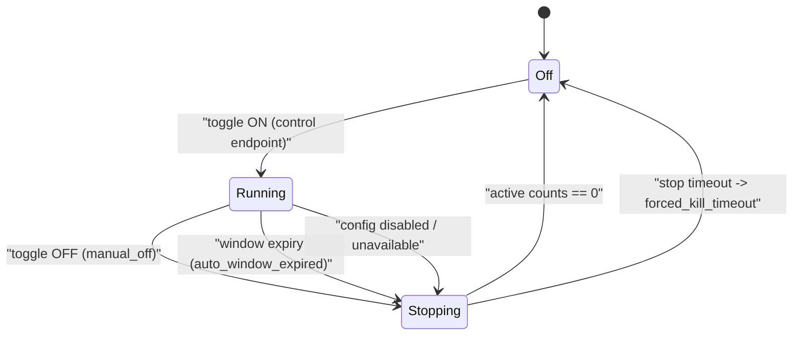

# Adversarial Simulation Operator Guide

Date: 2026-02-27  
Status: Active (`SIM-6`)

This guide defines how operators must interpret adversarial simulation failures and how to tune safely without introducing collateral-risk regressions.

## Scope

Use this guide for:

- `make test-adversarial-fast`
- `make test-adversarial-soak`
- `make test-adversarial-live`

All profiles write a report to `scripts/tests/adversarial/latest_report.json` unless `ADVERSARIAL_REPORT_PATH` overrides it.

## Inputs You Must Capture

For every failing run, operators must capture:

1. Exact command used (`make` target + env overrides).
2. Report artifact (`scripts/tests/adversarial/latest_report.json`).
3. Runtime config snapshot (`GET /admin/config`) from the failing environment.
4. Monitoring snapshot (`GET /admin/monitoring`) from the same time window.
5. Commit SHA and environment (`runtime-dev` or `runtime-prod`).

## Triage Order

Operators must triage in this order:

1. Scenario failures in `results` where `passed=false`.
2. Gate failures in `gates.checks` where `passed=false`.
3. Coverage deltas in `gates.coverage.deltas` (for `full_coverage`/soak).

Operators must not tune thresholds before confirming whether failures are scenario mismatches versus gate regressions.

## Scenario Failure Interpretation

When `passed=false`, use `driver`, `expected_outcome`, `observed_outcome`, and `detail`.

### Driver-to-Action Mapping

| Driver | Expected posture | Primary checks | Typical operator action |
|---|---|---|---|
| `allow_browser_allowlist` | `allow` | browser allowlist and policy mode | Correct allowlist entries; avoid broad wildcarding |
| `not_a_bot_pass` | `not-a-bot` | Not-a-Bot token flow and pass scoring | Adjust pass/fail scores in small increments |
| `not_a_bot_replay_abuse` / `not_a_bot_stale_token_abuse` / `not_a_bot_ordering_cadence_abuse` | `maze` | replay/order/timing protections | Keep abuse escalation strict; fix sequence checks if downgraded |
| `pow_success` | `allow` | `/pow` issue + `/pow/verify` success | Validate PoW difficulty/TTL and sequence timing envelope |
| `pow_invalid_proof` | `monitor` | PoW invalid proof rejection path | Ensure invalid proof remains rejected; do not downgrade to allow |
| `rate_limit_enforce` | `deny_temp` | limiter thresholds and enforcement mode | Verify `rate_limit`, provider mode, and outage posture |
| `geo_challenge` / `geo_maze` / `geo_block` | `challenge` / `maze` / `deny_temp` | GEO lists and trusted header gating | Confirm country list routing and trusted header behavior |
| `honeypot_deny_temp` | `deny_temp` | honeypot path and ban enforcement | Verify honeypot remains active and banning works |
| `akamai_additive_report` | `monitor` | additive edge signal ingest | Keep additive mode non-authoritative |
| `akamai_authoritative_deny` | `deny_temp` | authoritative edge deny path | Verify deny only in authoritative mode |

## Gate Failure Interpretation

`gates.checks` includes quantitative assertions.

## Dashboard Toggle Orchestration (SIM-V2-9A)

The dashboard `Adversary Sim` global toggle is the only supported UI control path for dev orchestration lifecycle.

Control-plane endpoints:

1. `POST /admin/adversary-sim/control` for explicit ON/OFF transitions.
2. `GET /admin/adversary-sim/status` for phase + guardrail visibility.

Guardrail constants (hard-coded, not operator-configurable):

1. `max_duration_seconds=900` (runtime key `adversary_sim_duration_seconds` is bounded to `30..900`, default `180`).
2. `max_concurrent_runs=1`.
3. `cpu_cap_millicores=1000`.
4. `memory_cap_mib=512`.
5. `queue_policy=reject_new`.

Lifecycle state diagram:

Failure-handling rules:

1. Unauthenticated, unauthorized, and CSRF-invalid control attempts must be rejected and written to admin event log.
2. If stop does not converge to zero-active state before stop timeout, orchestrator must force-kill and return to safe `off` state.
3. If runtime is not `runtime-dev` or `SHUMA_ADVERSARY_SIM_AVAILABLE=false`, control/status endpoints must fail closed (`404`).
4. Status polling and top progress-line rendering are presentation only; defense behavior remains server-authoritative.

### `latency_p95` Failure

- Operators must verify runtime saturation before relaxing latency limits.
- Operators must not widen thresholds by more than 20% in one change.

### `ratio_*` Failure

- Operators must confirm scenario composition did not change.
- Operators must tune policy inputs (for example rate/GEO/Not-a-Bot thresholds), not the ratio bounds first.
- Operators must update ratio bounds only after observed behavior is intentionally changed and documented.

### `telemetry_*_amplification` Failure

- Operators must treat this as a resource/cost regression first.
- Operators must reduce noisy writes (event volume, duplicate logging paths) before relaxing amplification limits.

### `coverage_*` Failure (Soak)

- Operators must confirm the corresponding scenario driver actually executed.
- Operators must confirm monitoring counters are still mapped to the same semantic event.
- Operators must not disable coverage checks to make failures disappear.

## Safe Tuning Rules

1. Operators must change one control family at a time (for example only `rate_limit` knobs, then rerun).
2. Operators must rerun `make test-adversarial-fast` after every tuning change.
3. Operators must rerun `make test-adversarial-soak` before promotion when tuning touched PoW/rate/GEO/Akamai pathways.
4. Operators must document every threshold change with before/after values and reason.
5. Operators must not combine unrelated policy and observability changes in one promotion.

## Rollback Rules

Rollback must be immediate when any of the following occurs:

1. `fast` profile fails after a tuning change.
2. Any abuse scenario downgrades from `maze`/`deny_temp` to `allow`/`monitor`.
3. Telemetry amplification exceeds bounds by more than 2x baseline.
4. GEO/Rate/PoW enforcement drops below expected coverage deltas in soak.

Rollback action:

1. Restore last known-good config snapshot.
2. Re-run `make test-adversarial-fast`.
3. Re-run `make test-adversarial-soak` before reattempting promotion.
