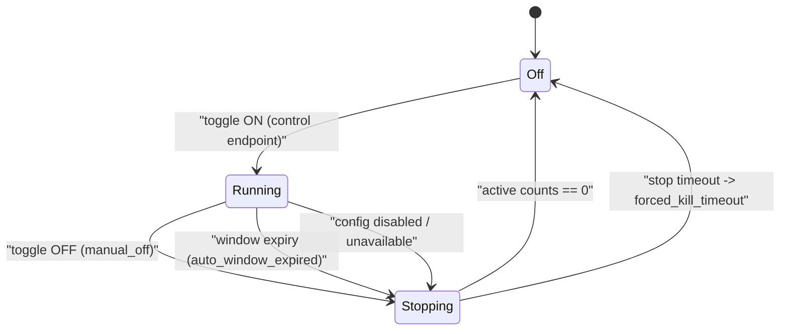

# Adversarial Simulation Operator Guide

Date: 2026-02-27  
Status: Active (`SIM-6`)

This guide defines how operators must interpret adversarial simulation failures and how to tune safely without introducing collateral-risk regressions.

## Scope

Use this guide for:

- `make test-adversarial-fast`
- `make test-adversarial-soak`
- `make test-adversarial-live`
- `make test-adversarial-repeatability`
- `make test-adversarial-promote-candidates`
- `make test-adversarial-scenario-review`
- `make test-adversarial-sim-tag-contract`
- `make test-frontier-unavailability-policy`
- `make test-adversarial-container-isolation`
- `make test-adversarial-container-blackbox`

## Runtime Heartbeat Ownership

Runtime-toggle adversary generation is owned by a host-side supervisor heartbeat, not by dashboard polling:

1. Dashboard uses control/status endpoints only (`/shuma/admin/adversary-sim/control`, `/shuma/admin/adversary-sim/status`).
2. Host-side supervisors call the internal beat endpoint (`POST /shuma/internal/adversary-sim/beat`) on cadence and post bounded worker results through `POST /shuma/internal/adversary-sim/worker-result` when `scrapling_traffic` is active.
3. Local make targets (`make dev`, `make dev-prod`, `make run`, `make run-prebuilt`, `make prod`) wrap Spin with `scripts/run_with_oversight_supervisor.sh`, which chains the existing adversary-sim supervisor wrapper and adds bounded periodic recommend-only oversight runs on shared-host deployments.
4. Equivalent worker deployment adapters are supported for single-host service managers and container sidecars. External edge supervisor services remain a deferred boundary note, not the current supported full hosted Scrapling runtime target.
5. Host-side supervisor requests use trusted-forwarding plus the internal supervisor marker so `runtime-prod` deployments can keep HTTPS enforcement and operator IP allowlists without starving the supervisor.
6. `make setup` and `make setup-runtime` now also provision the repo-owned `.venv-scrapling` runtime used by the real Scrapling worker and its focused verification gates.

## Telemetry Is The Map

For adversarial simulation work, operators should treat observed telemetry as the authoritative map of what the adversary actually reached.

That means:

1. minimal seeds and scope fences are the starting contract,
2. traversal telemetry defines the reachable surface that Shuma should reason about,
3. replay-promotion candidates should come from observed telemetry traces,
4. and routes that never appear in telemetry do not belong in the active adversary surface map unless a narrower safety or operator contract explicitly requires them.

For shared-host emergent-lane preparation, the normal operator/deployer path is now agent-facing:

1. use `make prepare-scrapling-deploy PREPARE_SCRAPLING_ARGS='--public-base-url https://example.com --runtime-mode ssh_systemd'` when you need to inspect or regenerate the deploy-time receipt directly,
2. or use the canonical shared-host deploy path, which now runs the same helper automatically from the final public base URL,
3. keep the resulting receipt as proof of the inferred fail-closed scope fence and root-only seed,
4. treat the generated artifact as accepted start URLs plus bounded hint documents only,
5. and do not treat gateway catalogs, `robots.txt`, or sitemap hints as the authoritative reachable-surface map.

Manual `make build-shared-host-seed-inventory` remains available for explicit operator-curated cases, not as the default deploy journey.

## Production Operating Receipt (`SIM-DEPLOY-2`)

Production adversary-sim is now a normal Shuma operating lane, not a runtime-prod exception.

That means operators should keep one standard receipt whenever they validate or exercise the lane on a deployed instance:

1. read `GET /shuma/admin/adversary-sim/status` while the lane is off and confirm the explicit production posture:
   - `gateway_deployment_profile` matches the deployment,
   - `guardrails.surface_available_by_default=true`,
   - `guardrails.generation_default=off_until_explicit_enable`,
   - `guardrails.generation_requires_explicit_enable=true`.
2. enable the lane once through `POST /shuma/admin/adversary-sim/control` or the dashboard `Red Team` toggle and keep the returned ON `operation_id`.
3. run `make test-adversary-sim-runtime-surface` against the running target and keep the evidence that it proved both deterministic defense-surface coverage and live-summary no-impact.
4. when the shared-host recommend-only feedback loop is part of the deployed target, run `make test-live-feedback-loop-remote` and keep the evidence that it proved the host is running through `scripts/run_with_oversight_supervisor.sh`, that public oversight status is readable, and that completed adversary-sim traffic produced a linked post-sim agent run.
5. disable the lane through the same control endpoint and keep the OFF `operation_id` as the production kill-switch receipt.
6. use `POST /shuma/admin/adversary-sim/history/cleanup` only when retained telemetry reset is intentionally required; normal OFF does not imply cleanup.

## Shared-Host Scrapling Operator Journey

For the current full hosted Scrapling runtime, the expected journey is:

1. deploy or update the shared-host target through the canonical shared-host path and let it infer the Scrapling scope, root-only seed, and `ADVERSARY_SIM_SCRAPLING_*` runtime env contract automatically,
2. keep the deploy-time receipt and the focused `make test-scrapling-deploy-shared-host` proof as deployment evidence,
3. before first enable, confirm deployment egress is constrained externally to the approved public host plus DNS; Shuma enforces hosted scope in application logic, but outbound sandboxing remains a deployer responsibility,
4. with adversary sim off, preselect `scrapling_traffic` through `POST /shuma/admin/adversary-sim/control` or the Dashboard `Red Team` lane selector,
5. toggle the simulator on and keep the accepted ON `operation_id`,
6. watch `desired_lane` versus `active_lane` converge at the next beat boundary,
7. use monitoring, event telemetry, and lane diagnostics as the runtime surface truth while the lane runs,
8. toggle the simulator off and keep the accepted OFF `operation_id`; retained telemetry stays visible until normal retention expiry or explicit cleanup.

If the deployment target is Fermyon/Akamai edge, stop at the gateway-only posture. That path can expose truthful lifecycle/control surfaces, but it is not the current supported full hosted Scrapling worker target.

## SIM Run Definition Of Done (`SIM2-GC-1`)

A run must be treated as complete only when all rules below are true:

1. `latest_report.json` has `passed=true`.
2. `latest_report.json` includes `real_traffic_contract` and `evidence` sections.
3. Every passed scenario includes runtime telemetry evidence in `evidence.scenario_execution`:
   - `runtime_request_count > 0`
   - plus at least one runtime telemetry delta (`monitoring_total_delta`, `coverage_delta_total`, or `simulation_event_count_delta`) above zero.
4. `evidence.control_plane_lineage` is present with:
   - `control_operation_id`, `requested_state`, `desired_state`, `actual_state`, `actor_session`.
5. No synthetic-success pattern is used:
   - no synthetic monitoring injection,
   - no out-of-band metrics writes,
   - no control-plane-only success signaling.
6. Every passed `browser_realistic` scenario includes browser execution evidence:
   - `browser_js_executed=true`,
   - `browser_dom_events > 0`,
   - non-empty `browser_challenge_dom_path`,
   - non-empty request-lineage correlation IDs.

Canonical contract reference:

- [`sim2-real-adversary-traffic-contract.md`](sim2-real-adversary-traffic-contract.md)

All profiles write a report to `scripts/tests/adversarial/latest_report.json` unless `ADVERSARIAL_REPORT_PATH` overrides it.
All runs also emit `scripts/tests/adversarial/attack_plan.json` with frontier mode/provider metadata and sanitized candidate payloads.
Promotion triage emits `scripts/tests/adversarial/promotion_candidates_report.json` with candidate -> replay -> promotion lineage records.
The same promotion run must also materialize bounded replay-promotion lineage into Shuma through `POST /shuma/admin/replay-promotion`; later controller reads consume that backend contract through `GET /shuma/admin/replay-promotion`, nested `operator_snapshot_v1.replay_promotion`, and nested `benchmark_results_v1.replay_promotion` rather than parsing the sidecar JSON directly.
Frontier threshold policy emits `scripts/tests/adversarial/frontier_unavailability_policy.json`.
All manifests and reports are locked to `execution_lane=black_box`; non-black-box lane values are rejected at validation time.
Lane capability boundaries are versioned in `scripts/tests/adversarial/lane_contract.v1.json` and validated by `make test-adversarial-lane-contract`.
Lane realism profiles are versioned in `scripts/tests/adversarial/lane_realism_contract.v1.json` and validated by `make test-adversarial-lane-realism-contract`.
Simulation-tag signing contract is versioned in `scripts/tests/adversarial/sim_tag_contract.v1.json` and validated by `make test-adversarial-sim-tag-contract`.
Full-coverage category obligations are versioned in `scripts/tests/adversarial/coverage_contract.v2.json` (with temporary v1 compatibility) and validated by `make test-adversarial-coverage-contract`.
Container frontier action grammar contract is versioned in `scripts/tests/adversarial/frontier_action_contract.v1.json` and enforced as reject-by-default by host and worker validators.
Container runtime hardening profile is versioned in `scripts/tests/adversarial/container_runtime_profile.v1.json` and must pass before worker launch.
The same artifacts now also carry the bounded LLM fulfillment contract used by the shared-host red-team lane planning hook:
1. `frontier_action_contract.v1.json -> llm_fulfillment`
   - backend kinds,
   - browser/request mode tool envelopes,
   - canonical category targets.
2. `container_runtime_profile.v1.json -> llm_fulfillment_runtime`
   - browser/request runtime budgets,
   - browser-automation permission,
   - direct-request permission.
`make test-adversarial-llm-fit` is the focused proof gate for that bounded contract and the internal beat payload it drives.
The same adversarial contract family now also freezes the first category-to-lane fulfillment basis used by the closed-loop work:
1. `coverage_contract.v2.json -> non_human_lane_fulfillment`
   - canonical non-human categories,
   - `mapped` versus `gap` assignment status,
   - intended runtime lane and fulfillment mode,
   - Scrapling coverage basis where request-native and browser-native proof is now receipt-backed,
   - scenario references kept explicitly as intent support rather than coverage proof.
2. `scenario_intent_matrix.v1.json -> rows[].non_human_category_targets`
   - scenario-level intended non-human category targets,
   - alignment checks against the coverage contract,
   - execution-evidence annotation for later coverage receipts.
`make test-adversarial-coverage-contract` and `make test-adversarial-scenario-review` freeze the fulfillment matrix itself. `make test-adversarial-coverage-receipts` now proves the current full-spectrum Scrapling coverage receipts that later Monitoring and bounded tuning consume.
For the current full-spectrum expansion, Scrapling now owns these canonical categories in the frozen fulfillment matrix:
1. `indexing_bot` via `crawler`
2. `ai_scraper_bot` via `bulk_scraper`
3. `automated_browser` via `browser_automation` and `stealth_browser`
4. `http_agent` via `http_agent`
The internal Scrapling worker plan now carries `fulfillment_mode`, bounded `category_targets`, optional request or browser proxy hints, and a versioned `realism_profile` so the shared-host lane can ask for a specific request-native or browser persona without pretending the whole lane is one undifferentiated crawler.
That `realism_profile` is the executable cadence contract for the later realism chain: activity-budget ranges, burst/jitter windows, pause or dwell windows, identity rotation posture, browser/JavaScript propensity, retry ceilings, and the receipt fields later tranches must materialize. Host-side Scrapling and Agentic workers now validate that profile against the canonical `lane_realism_contract.v1.json` contract before executing a tick, so planner/worker drift fails closed instead of silently changing attacker-shape semantics.
Scrapling now also materializes a per-tick `realism_receipt` alongside its worker result and recent-run monitoring history: the receipt records the effective activity budget and burst size chosen for the tick, the actual activity count, request-gap or dwell intervals used, session or identity handles, identity-rotation count, and the stop reason that terminated the bounded tick.
`SIM-REALISM-2A` now extends that contract into pressure truth instead of leaving the stronger profiles clipped behind a legacy flat ceiling: request-native Scrapling personas consume their own profile-specific pressure envelopes, and Agentic request-mode executes each micro-burst as a bounded concurrent group rather than serializing all activity through one sequential stream. The observer-only receipts now preserve peak concurrent activity and the exact concurrency grouping used so faster attacker-shape proof does not collapse into guesswork.
`SIM-REALISM-2B` now extends the same contract into identity truth: the canonical realism profiles carry a bounded `identity_envelope` describing identity class, geo affinity, session stickiness, and degraded-local fallback posture; the Rust planners can now load pool-backed identities from `ADVERSARY_SIM_SCRAPLING_REQUEST_PROXY_POOL_JSON`, `ADVERSARY_SIM_SCRAPLING_BROWSER_PROXY_POOL_JSON`, and `ADVERSARY_SIM_AGENTIC_REQUEST_PROXY_POOL_JSON`; and the host-side Scrapling plus Agentic workers propagate those pools into observer-only `realism_receipt` fields such as `identity_realism_status`, `identity_envelope_classes`, `geo_affinity_mode`, `session_stickiness`, and `observed_country_codes`.
That identity truth is strictly observer-side realism evidence. It must not become defence truth, category truth, or any sim-only trusted-header shortcut. When a pool is absent, the receipts now explicitly say identity realism is degraded instead of pretending that local session churn is equivalent to real residential or mobile network diversity.
`SIM-REALISM-2C` now extends the same contract into transport-envelope truth: the canonical realism profiles carry a bounded `transport_envelope` describing request and browser client posture, geo-aligned Accept-Language or locale strategy, and the transport profile the current libraries actually expose; Scrapling request-native personas now stop pinning every run to one `en-GB` Chrome-like posture, Agentic request-mode now emits explicit per-action request headers aligned to the chosen identity envelope, and Agentic browser-mode now carries explicit locale plus browser client posture into the Playwright session instead of relying on one hard-coded desktop default.
That transport truth remains observer-side execution evidence only. It must not be promoted into defence truth, trusted provenance, or any simulator-only category signal. The new receipt fields exist to show which bounded header or locale envelope was applied, not to grant the simulator special status in the runtime.
Agentic request-mode now materializes both kinds of proof through its dedicated LLM runtime path: the host worker shapes one focused page set plus profile-driven micro-bursts and between-burst pauses, assigns pooled identities per burst when they exist, the container black-box worker emits a typed `realism_receipt` with effective activity budget, executed burst sizes, inter-activity gaps, concurrency group sizes, peak concurrent activity, session handles, identity-realism posture, and stop reason, and the recent-run monitoring summary preserves that latest Agentic receipt alongside additive LLM runtime lineage. Degraded provider fallback must still respect that pacing and identity contract; it must not collapse back into a generic root-plus-public-hints loop just because the provider path is unavailable.
Agentic browser-mode now uses a real Playwright-driven black-box session instead of the old `browser_mode_not_supported` placeholder: the host worker shapes a small browser session plan from the bounded realism profile, the browser driver starts at the host root, uses public hint breadcrumbs such as `/robots.txt` and same-origin sitemap references to reach the generated root-hosted contributor terrain without hidden route catalogs, emits a browser-shaped `realism_receipt` with top-level action count, dwell intervals, stable session handles, and stop reason, and recent-run monitoring history preserves that latest browser receipt alongside additive LLM runtime lineage.
`SIM-REALISM-2D` now extends both browser lanes into compact secondary-traffic truth instead of leaving them understated as top-level page visits only. Scrapling browser personas reuse upstream XHR capture and receipt compact `secondary_capture_mode`, `secondary_request_count`, `background_request_count`, and `subresource_request_count` fields without shipping raw browser traces; Agentic browser-mode uses same-origin browser request events to preserve the same compact counts in its `browser_evidence` and `realism_receipt`; and the recent-run plus operator-snapshot read models now project those fields so machine-facing surfaces can distinguish top-level navigation from background or subresource activity without bloating hot reads.
That secondary-traffic truth is still observer-side execution evidence only. It must not become defence truth, trusted provenance, or a simulator-only path catalog. The receipt fields exist to prove that browser sessions emitted realistic secondary traffic, not to hand Shuma any privileged view of the attacker plan.
That plan must not carry a convenience route catalog or any synthetic host-internal map. Scrapling must begin from the accepted root or hint documents, then discover links, forms, redirects, and public challenge surfaces from host-visible responses during the run.
That persona split is now implemented in the worker itself:
1. `crawler` keeps the bounded spider traversal behavior,
2. `bulk_scraper` performs breadth-first direct retrieval over pagination and detail targets that it discovered from public pages inside the shared-host scope fence,
3. `browser_automation` executes public traversal, JS verification, and maze progression through a dynamic browser session after discovering those entrypoints from the host root,
4. `stealth_browser` repeats that browser path with stealth settings and browser-detection pressure,
5. `http_agent` performs bounded direct request traffic with discovered forms, JSON request bodies, and in-scope redirect follow-up.
Those live worker requests now also carry mode-specific signed simulation telemetry (`scrapling_runtime_lane.<mode>`), and every bounded Scrapling worker tick now persists an observer receipt event even when its owned-surface receipt list is empty. The recent-sim hot-read projection folds those per-tick receipts back into normalized Scrapling run summaries with observed fulfillment modes, observed category ids, and owned-surface receipts. That is the current machine-first basis for proving full-spectrum Scrapling coverage of `indexing_bot`, `ai_scraper_bot`, `automated_browser`, and `http_agent`, plus owned-surface evidence for `maze_navigation`, `js_verification_execution`, and `browser_automation_detection`.
`browser_agent` and `agent_on_behalf_of_human` remain outside Scrapling ownership and stay mapped to the bounded LLM/browser track for now.
For loopback-hosted Spin targets, the runner selects the least-surprising reachable Docker transport per host platform: bridge + `host.docker.internal` where that reaches host loopback, and Linux host-network mode when bridge reachability would otherwise fail against a `127.0.0.1`-bound server.
Signed capability envelopes for executable worker actions are enforced via `scripts/tests/frontier_capability_envelope.py` host/worker validation.
Browser-lane execution proof is enforced via `latest_report.json -> gates.browser_execution_gates`.
`make test-adversarial-live` now classifies failures as `transient` or `fatal`, retries transient cycles with capped backoff, and only terminates after `ADVERSARIAL_FATAL_CYCLE_LIMIT` consecutive fatal cycles.
Container lane emits:
1. `scripts/tests/adversarial/container_isolation_report.json`
2. `scripts/tests/adversarial/container_blackbox_report.json`
3. `container_blackbox_report.json` includes `frontier_action_source` and `frontier_action_lineage` to trace attack-plan candidates to executed requests.
4. `container_blackbox_report.json -> policy_audit` records explicit deny/allow boundary decisions for action validation and egress-policy enforcement.
5. `container_blackbox_report.json -> frontier_candidate_rejections` lists sanitized model outputs that were blocked before execution.
6. `container_blackbox_report.json -> frontier_lineage` reports end-to-end lineage completeness (`model suggestion -> executed action -> runtime events -> monitoring events`).
7. `container_blackbox_report.json -> frontier_runtime_state` surfaces degraded fallback/outage conditions and marks degraded runs as non-passing.
8. `container_blackbox_report.json -> runtime_profile` reports required hardening profile compliance and any launch-blocking violations.
9. `container_blackbox_report.json -> capability_envelopes` reports capability-envelope enforcement posture for executable actions.
10. `container_blackbox_report.json -> cleanup_policy` reports TTL cleanup execution (`deleted_count`, `failed_count`, and per-path diagnostics).
11. `container_blackbox_report.json -> command_channel` reports one-way bounded queue semantics (`queue_capacity`, `overflow_count`, and append-only evidence expectations).
12. `container_blackbox_report.json -> execution_control` and `worker_failure_detail` report kill-switch/heartbeat/deadline teardown outcomes and forced-stop diagnostics.

## Deterministic + Containerized Coexistence Contract (SIM-V2-15)

Current policy is explicit coexistence, not replacement:

1. Deterministic lanes are the canonical protected-lane and release blockers:
   - `make test-adversarial-smoke`
   - `make test-adversarial-abuse`
   - `make test-adversarial-akamai`
   - `make test-adversarial-coverage`
2. Containerized black-box lanes are complementary and scheduled/manual in this phase:
   - `make test-adversarial-container-isolation`
   - `make test-adversarial-container-blackbox`
   - container executions must pass frontier action DSL validation before any request is emitted.
3. Frontier lane remains adaptive discovery input; deterministic replay confirmation remains the blocking regression oracle.

Capability mapping (must stay explicit):

| Requirement family | Deterministic lane (mandatory) | Containerized lane (complementary) |
|---|---|---|
| Merge/release blocking regression oracle | Primary and required | Not used as release blocker in this phase |
| Full category gate contract (`full_coverage`) | Primary and required | Observational/complementary |
| Replay/order/stale deterministic abuse regressions | Primary and required | Complementary realism signal |
| Akamai fixture policy behavior | Primary and required | Not primary coverage contract |
| Isolation boundary and runtime-hardening checks | Not primary | Primary (`container_isolation`) |
| Alternative runtime traffic realism signal | Secondary | Primary (`container_blackbox`) |
| Frontier candidate promotion confirmation | Primary (`promote-candidates` replay gate) | Not primary |

Keep-both-vs-replace decision record:

1. ADR: [`docs/adr/0005-adversarial-lane-coexistence-policy.md`](adr/0005-adversarial-lane-coexistence-policy.md).
2. Required migration checklist template: [`docs/adr/adversarial-lane-parity-signoff-checklist.md`](adr/adversarial-lane-parity-signoff-checklist.md).
3. Deterministic-lane demotion is forbidden without owner approval plus completed parity sign-off evidence.

## Simulation Metadata Tagging and Filtering (SIM-V2-20)

Adversary-generated traffic is tagged at request time with:

1. `sim_run_id`
2. `sim_profile`
3. `sim_lane`
4. `sim_ts`
5. `sim_nonce`
6. `sim_signature` (HMAC-SHA256 over canonical `sim-tag.v1` message)

Those tags are an attribution and observability contract only. They exist so monitoring, benchmarking, and the Game Loop observer can correlate simulated traffic after the fact. Shuma defence surfaces must not treat those tags as category truth, must not use them as a shortcut for allow, block, or challenge outcomes, and must instead judge the traffic only from properties that would also be available on equivalent external traffic.

Storage and read-path policy:

1. Simulation telemetry writes to canonical event/monitoring stores and is identified by metadata fields (`sim_run_id`, `sim_profile`, `sim_lane`, `is_simulation`).
2. Admin read endpoints (`/shuma/admin/events`, `/shuma/admin/cdp/events`, `/shuma/admin/monitoring`, `/shuma/admin/monitoring/delta`, `/shuma/admin/monitoring/stream`, `/shuma/admin/ip-bans/delta`, `/shuma/admin/ip-bans/stream`) include tagged simulation rows whenever adversary simulation is active, with pseudonymized sensitive identifiers unless explicit forensic break-glass is acknowledged (`forensic=1&forensic_ack=I_UNDERSTAND_FORENSIC`).
3. Deployments remain default-safe because adversary traffic generation stays off until an operator enables it through `POST /shuma/admin/adversary-sim/control` (or the dashboard `Red Team` toggle), even though the control surface is available by default. `SHUMA_ADVERSARY_SIM_ENABLED` seeds only the initial desired state; once any lifecycle state is persisted, `ControlState.desired_enabled` becomes the sole desired-state authority surfaced through status, config runtime overlays, and the root-hosted generated contributor surface being available.
   The same control endpoint with `{"enabled":false}` is the production kill-switch path; there is no separate runtime override writer.
   Treat this as a normal deployment receipt, not as a one-off validation path: keep the off-state status proof, ON/OFF `operation_id` values, and the runtime-surface no-impact proof together whenever production adversary-sim is exercised.
4. Unsigned/invalid/stale/replayed simulation tags must not activate simulation context; requests stay in normal telemetry partition.
5. Invalid simulation-tag attempts emit explicit policy-signal telemetry:
   - `S_SIM_TAG_MISSING_SECRET`
   - `S_SIM_TAG_MISSING_REQUIRED_HEADERS`
   - `S_SIM_TAG_INVALID_HEADER_VALUE`
   - `S_SIM_TAG_INVALID_TIMESTAMP`
   - `S_SIM_TAG_TIMESTAMP_SKEW`
   - `S_SIM_TAG_SIGNATURE_MISMATCH`
   - `S_SIM_TAG_NONCE_REPLAY`

Containerized attacker-lane handling:

1. Container black-box workers must not receive `SHUMA_*` secrets (including `SHUMA_SIM_TELEMETRY_SECRET`).
2. Host orchestrator issues bounded pre-signed sim-tag envelopes per run and passes only those non-secret envelopes into the container.
3. Replay-window checks in runtime enforce one-use nonce semantics for signed tags.

## Sim-Tag Secret Rotation and Troubleshooting

Rotation policy:

1. Rotate `SHUMA_SIM_TELEMETRY_SECRET` whenever adversarial runner hosts are reprovisioned or when simulation-tag validation anomalies are detected.
2. Rotate by updating the secret in `.env.local`/deploy environment, restarting the affected runtime, and re-running `make test-adversarial-fast`.
3. Do not share this secret with containerized attacker lanes; only deterministic host-side signers should hold it.
4. Local dev cadence must rotate at least every 30 days when adversarial lanes are used regularly.
5. CI lanes must use centrally managed secret storage and must not commit raw secret values to repository files.
6. CI secret cadence must rotate at least every 14 days or immediately on suspected compromise.

Compromise-response workflow:

1. Detect: identify leak signal (`S_SIM_TAG_SIGNATURE_MISMATCH` spikes, unexpected nonce replay, or secret exposure evidence).
2. Contain: disable adversarial protected lanes temporarily and rotate `SHUMA_SIM_TELEMETRY_SECRET` in all affected environments.
3. Recover: restart the affected runtime/CI runners, run `make test-adversarial-preflight`, then run `make test-adversarial-fast`.
4. Verify: confirm signature and replay failures return to baseline, then re-enable normal adversarial schedules.
5. Record: capture incident notes with rotation timestamp and impacted environments.

Troubleshooting sequence for failed sim tagging:

1. Confirm adversary-sim surface availability: `SHUMA_ADVERSARY_SIM_AVAILABLE=true`.
2. Confirm secret presence on host runner and runtime process: `SHUMA_SIM_TELEMETRY_SECRET` is non-empty.
3. Run `make test-adversarial-preflight` to verify required secret posture (`missing` vs `placeholder` vs `invalid format`) and browser-lane Chromium readiness.
4. Run `make test-adversarial-sim-tag-contract` to verify contract parity.
5. Inspect `/shuma/metrics` for `bot_defence_policy_signals_total{signal=\"S_SIM_TAG_*\"}` counters and identify dominant failure reason.
6. If failures persist, restart `make dev` to clear stale process env and rerun `make test-adversarial-fast`.

## Frontier Architecture Modes

Frontier attack-candidate generation must run in one of two explicit modes:

1. `single_provider_self_play`
2. `multi_provider_playoff`

Mode semantics:

1. `single_provider_self_play`
   - One configured provider key.
   - Planner/attacker/critic roles remain isolated but share one model family.
   - Discovery confidence is lower because role diversity is reduced.
2. `multi_provider_playoff`
   - Two or more configured provider keys.
   - Cross-provider role assignment increases adversarial diversity.
   - Discovery confidence is higher and this is the recommended protected-lane posture.

Operator guidance:

1. `provider_count=0`: run remains deterministic-only; frontier lane is degraded advisory mode.
2. `provider_count=1`: run remains valid but reduced-diversity warning must be treated as a confidence downgrade.
3. `provider_count>=2`: preferred minimum for higher-confidence discovery.

## Protected-Lane Policy (Deterministic Oracle + Frontier Advisory)

Protected lanes must run both:

1. Deterministic coverage oracle (`make test-adversarial-coverage`) as a blocking gate.
2. Frontier lane attempt (`make test-adversarial-frontier-attempt`) as advisory telemetry.

Rules:

1. Frontier degraded status (missing key, auth error, timeout, provider outage) is non-blocking.
2. Deterministic coverage/replay failures remain merge/release blockers.
3. Frontier attempt output (`scripts/tests/adversarial/frontier_lane_status.json`) must be archived for PR/release auditing.
4. If frontier status remains degraded for 10 consecutive protected-lane runs or 7 days (whichever comes first), operators must open and assign a supported-model refresh action and update frontier model documentation.
5. Protected-lane automation uses `make test-frontier-unavailability-policy` (with `FRONTIER_POLICY_ENABLE_GITHUB=1`) to update tracker state and open/assign refresh action issues when the threshold is crossed.
   - If repository Issues are disabled, the same command must stay artifact-only and record that GitHub issue tracking is unavailable instead of failing the automation.

## Frontier Finding Triage + Promotion (SIM-V2-18)

`make test-adversarial-promote-candidates` is the canonical triage/promotion lane.

Pipeline contract:

1. Normalize frontier findings into stable IDs (`finding_id`) with scenario family, path, headers, cadence pattern, observed outcome, severity, and risk metadata.
2. Carry frontier diversity metadata on every finding (`frontier_mode`, `provider_count`, provider/model list, `diversity_confidence`).
3. Carry generated-candidate lineage metadata on every finding (`candidate_id`, `source_scenario_id`, `generation_kind`, `mutation_class`, `behavioral_class`, `novelty_score`).
4. Attempt deterministic replay for each regression candidate and classify:
   - `confirmed_reproducible`
   - `not_reproducible`
   - `needs_manual_review`
5. Require owner review before any confirmed finding can become a blocking regression case.
6. Enforce diversity policy:
   - `single_provider_self_play`: owner review is mandatory and confidence is reduced.
   - `multi_provider_playoff`: higher initial confidence, but deterministic confirmation and owner review are still mandatory.

Generated-candidate governance must be explicit before replay:

1. `attack_plan.json` must include `attack_generation_contract` metadata (path, schema version, hash).
2. `generation_summary` must report `seed/generated/accepted/rejected` candidate counts.
3. Candidate-level governance fields (`governance_passed`, novelty score, mutation metadata) must be present and valid.
4. Candidates that fail sanitization/policy checks must be recorded under `rejected_candidates` and must not enter replay/promotion.

Operator curation workflow for promoting generated candidates into canonical manifests:

1. Sort `promotion_candidates_report.json` by:
   - `severity` (high first),
   - `replayability` (`confirmed_reproducible` first),
   - then `novelty_score`.
2. For each `confirmed_reproducible` mutation candidate, create or update a deterministic manifest scenario:
   - include `source_scenario_id`,
   - preserve `mutation_class` and `behavioral_class` in scenario description or tags,
   - attach owner and disposition target (`<=48h`).
3. Reject or merge duplicate low-value variants:
   - merge when candidate behavior is already covered by an existing deterministic scenario,
   - reject when collateral risk is not acceptable or replay confidence is insufficient.
4. Archive decision rationale in the promotion artifact (`owner_disposition`, review notes) so lineage remains auditable.

SLA for unresolved high-severity findings:

1. `PR` lanes: unresolved high-severity findings (`confirmed_reproducible` or `needs_manual_review`) must be dispositioned within 24 hours.
2. `Release` lanes: unresolved high-severity findings must be dispositioned before release cut; release remains blocked when deterministic replay confirms a high-severity regression.

## Run-to-Run Diff + Backlog Automation (SIM2-EX8-2 / SIM2-EX8-3)

Run `make test-adversarial-report-diff` after each protected-lane run pair where both baseline and candidate reports are available.

Diff artifact expectations (`scripts/tests/adversarial/adversarial_report_diff.json`):

1. Scenario transitions:
   - `new_passes`,
   - `new_regressions`,
   - `new_scenarios`,
   - `resolved_scenarios`.
2. Cost-shift deltas:
   - `latency_p95_delta_ms`,
   - `suite_runtime_delta_ms`,
   - request-count delta.
3. Collateral-shift deltas:
   - `human_like_collateral_ratio_delta`.
4. Defense-delta movement:
   - increased/decreased coverage telemetry deltas by metric.

Backlog conversion rules (mandatory):

1. Every `new_regression` must create or update a TODO item within one cycle:
   - include `scenario_id`,
   - owner role,
   - disposition SLA (`<=48h` default).
2. Priority mapping:
   - high-severity confirmed regressions: `P0`,
   - medium confirmed regressions: `P1`,
   - unconfirmed/non-reproducible findings: advisory tracking only.
3. TODO entries must include deterministic confirmation status and promotion lineage link.
4. If no `new_regressions` are present, record explicit “no actionable regressions” evidence in cycle notes.

## Promotion Hygiene and Scenario Corpus Maintenance (SIM2-EX8-4)

Promotion hygiene is mandatory for keeping deterministic manifests high-signal:

1. Merge duplicate scenarios when newly promoted behavior is already covered by an existing deterministic case.
2. Retire stale scenarios when:
   - no longer mapped to active defenses,
   - superseded by stronger deterministic replay cases,
   - consistently non-actionable over a full review window.
3. Reclassify scenarios (tier/driver/category) when observed behavior changes while relevance remains valid.
4. Every merge/retire/reclassify action must include written rationale and owner attribution in cycle notes.
5. Stale-scenario review must run at least monthly alongside architecture review.

## Continuous Defender-Adversary Evolution Cadence (SIM2-GC-12)

This cadence is mandatory and must run every week:

1. `run adversary -> review evidence -> tune defenses -> deterministic replay -> promote or reject`.
2. Owners must be explicit per cycle:
   - `security_engineering` owns adversary discovery quality and triage.
   - `runtime_engineering` owns mitigation changes and replay confirmation.
   - `platform_operations` owns rollout, rollback, and monitoring-health verification.
3. SLAs must be enforced:
   - regression confirmation: `<=24h`,
   - mitigation plan: `<=48h`,
   - owner disposition for promoted findings: `<=48h`.

Promotion rubric (must be recorded for every candidate):

| Dimension | Rule |
| --- | --- |
| `severity` | Must classify expected impact on abuse resistance and operator risk (`low/medium/high`). |
| `reproducibility` | Must prove deterministic replay status (`confirmed_reproducible` vs `not_reproducible`). |
| `collateral_risk` | Must estimate legitimate-user risk (`low/medium/high`) before promotion. |
| `mitigation_readiness` | Must identify mitigation owner and validation plan before blocking promotion. |

KPI reporting (must be reviewed weekly):

1. `attacker_cost_shift`
2. `human_friction_impact`
3. `detection_latency`
4. `mitigation_lead_time`
5. `time to regression confirmation`
6. `time to mitigation`
7. `collateral_ceiling` (human-like collateral ratio and breach windows)
8. `cost_asymmetry_trend`

Rollback playbook for over-trigger on legitimate traffic:

1. Trigger: defense tuning over-triggers legitimate traffic.
2. Required sequence:
   - contain impact,
   - rollback to last known good policy bundle,
   - run `make test-adversarial-fast`,
   - run deterministic replay for affected scenarios,
   - retune with reduced blast radius and revalidate.
3. Operators must not keep an over-triggering policy active while triage is pending.

Architecture review checkpoint:

1. Frequency: monthly.
2. Review focus must include:
   - decentralized orchestration posture,
   - capability-safety boundaries,
   - evidence integrity and lineage completeness.
3. Outcomes must be documented and linked from cycle notes.

## Hybrid Adversary Lane Contract (SIM2-GC-14)

Shuma uses a strict two-lane model:

1. `deterministic_conformance` lane:
   - release-blocking authority,
   - deterministic replay oracle,
   - canonical source for merge/release gating.
2. `emergent_exploration` lane:
   - non-blocking discovery lane,
   - adaptive attack exploration input,
   - may not block release without deterministic confirmation.

Choreography boundary:

1. Intentionally choreographed: `seed_scenarios`, `invariant_assertions`, `resource_guardrails`.
2. Must remain emergent: `crawl_strategy`, `attack_sequencing`, `adaptation`.

Emergent objective model:

1. Target assets: public HTTP surface.
2. Success functions: unexpected allow/monitor outcomes and bypass evidence.
3. Stop conditions: runtime budget exhausted, action budget exhausted, or kill switch.
4. Default emergent envelope must remain bounded to `<=180s` and `<=500 actions`.

Novelty and triage policy:

1. Every emergent finding must include deterministic normalization for:
   - `novelty`,
   - `severity`,
   - `confidence`,
   - `replayability`.
2. Triage ordering must prioritize severity and replayability before novelty.

Promotion bridge (mandatory sequence):

1. `generated_candidate -> deterministic_replay_confirmation -> owner_review_disposition -> promoted_blocking_scenario`.
2. Release-blocking decisions must not depend on stochastic-only emergent outputs.
3. Promotion thresholds are mandatory:
   - deterministic confirmation `>=95%`,
   - false discovery `<=20%`,
   - owner disposition SLA `<=48h`.

Lane metadata and lineage requirements:

1. Promotion artifact must include lane metadata and authority model.
2. Each lineage row must include:
   - `source_lane=emergent_exploration`,
   - `deterministic_replay_lane=deterministic_conformance`,
   - explicit `release_blocking_authority`.
3. Operator language must describe enabled adversary behavior as real attacker activity with deterministic replay used for release confidence.

## Live Loop Guardrails (SIM-V2-9)

Live-loop defaults are operator-observability-first:

1. `ADVERSARIAL_CLEANUP_MODE=0` (default) preserves state between cycles.
2. `ADVERSARIAL_CLEANUP_MODE=1` enables explicit cleanup-per-cycle mode.
3. Cycles that emit only admin/config noise (no meaningful defense event reasons) are classified as fatal-quality failures.
4. Loop logs include cycle classification, retry count, backoff seconds, and terminal failure reason.

## Inputs You Must Capture

For every failing run, operators must capture:

1. Exact command used (`make` target + env overrides).
2. Report artifact (`scripts/tests/adversarial/latest_report.json`).
   - During `make test`, this report reflects the last fast-profile run and is consumed by the advisory SIM2 matrix.
   - Strict deterministic SIM2 coverage proof comes from `make test-adversarial-coverage` / `make test-adversarial-soak`.
3. Attack plan artifact (`scripts/tests/adversarial/attack_plan.json`).
4. Runtime config snapshot (`GET /shuma/admin/config`) from the failing environment.
5. Monitoring snapshot (`GET /shuma/admin/monitoring?hours=24&limit=10` in dev runtime) from the same time window.
6. Commit SHA and environment (`runtime-dev` or `runtime-prod`).
7. Runner plane-separation evidence (`latest_report.json` -> `plane_contract`).
8. Coverage contract evidence (`latest_report.json` -> `coverage_contract`) including schema/hash and category obligations.
9. Realism evidence (`latest_report.json` -> `realism_metrics` + `realism_gates`) for pacing/retry/state-mode conformance.
10. Scenario intent evidence (`latest_report.json` -> `scenario_intent_gates`) to confirm each passed scenario emitted required defense-category signals.

## Triage Order

Operators must triage in this order:

1. Scenario failures in `results` where `passed=false`.
2. Gate failures in `gates.checks` where `passed=false`.
3. Coverage gate failures in `coverage_gates.checks` where `passed=false`.
4. Defense no-op detector failures in `coverage_gates.defense_noop_checks` (`full_coverage`) where `passed=false`.
5. Coverage deltas in `coverage_gates.coverage.deltas` (for `full_coverage`/soak).
6. Persona collateral and cost envelopes in `cohort_metrics`.
7. Realism gate failures in `realism_gates.checks` and persona/runtime evidence in `realism_metrics`.
8. Scenario intent gate failures in `scenario_intent_gates.checks` where per-scenario category evidence or progression constraints failed.
9. Seeded IP-range evidence in `ip_range_suggestions`.
10. Tarpit progression/fallback/escalation counters in Diagnostics (`Tarpit Progression` section) and `monitoring_after.tarpit.metrics` in report artifacts.

## Dashboard Triage/Replay/Tuning/Validation Loop (SIM2-GC-10)

When triaging adversary activity from `#game-loop`, operators must use this loop:

1. Triage:
   - You must start in `Recent Adversary Runs` and pick the latest `run_id` with unexpected ban outcomes or defense deltas.
   - You must cross-check the same run in `#ip-bans` before concluding no enforcement occurred.
2. Replay candidate isolation:
   - You must set `Recent Events` filters in this order: `origin=Simulation`, matching `scenario`, matching `lane`, then optional `defense`/`outcome`.
   - You must not classify a run as "clean" when Monitoring freshness is `degraded` or `stale`; rerun after freshness returns to `fresh` or capture degraded evidence explicitly.
3. Defense tuning:
   - You must use `Defense Trends` to identify drifted defenses (high triggers with low pass ratio or rising escalations).
   - You must tune one defense area at a time and record the exact config delta with the affected run id(s).
4. Validation:
   - You must rerun `make test-adversarial-fast` after each tuning slice.
   - You must rerun `make test-adversarial-soak` before promotion for threshold/policy changes that impact challenge, PoW, rate-limit, GEO, tarpit, or IP-range pathways.
   - You must verify replay evidence reappears in monitoring (`run_id`, scenario/lane rows, and defense-category outcomes) before marking the issue resolved.

## Scenario Intent Review Process (SIM2-GC-9)

Operators must run `make test-adversarial-scenario-review` at least weekly and before release cuts.

Review process requirements:

1. Confirm each scenario row in `scripts/tests/adversarial/scenario_intent_matrix.v1.json` matches `scenario_manifest.v2.json` for:
   - `expected_defense_categories`,
   - `driver_class`,
   - `traffic_model.persona`,
   - `traffic_model.retry_strategy`.
2. Confirm each category has at least one practical evidence signal mapping and no dead signal rules.
3. Confirm row review metadata is fresh (`last_reviewed_on` within `stale_after_days` governance budget).
4. Remove or refactor rows flagged redundant by signature drift checks before adding new scenarios.
5. Update row notes when scenario realism constraints change (retry, pacing, evasion, or driver-class behavior).

Operators must not tune thresholds before confirming whether failures are scenario mismatches versus gate regressions.

## Coverage Contract Update Protocol

When `full_coverage` obligations must change, update in this order:

1. Update SIM2 plan coverage table in `docs/plans/2026-02-26-adversarial-simulation-v2-plan.md`.
2. Update canonical contract `scripts/tests/adversarial/coverage_contract.v2.json`.
3. Update manifest `profiles.full_coverage.gates` parity in both `scenario_manifest.v1.json` and `scenario_manifest.v2.json`:
   - `coverage_requirements`,
   - `coverage_depth_requirements` (row-level depth metrics + scenario bindings).
4. Update `scripts/tests/adversarial/verification_matrix.v1.json` row bindings when depth rows change.
5. Run `make test-adversarial-coverage-contract`, `make test-adversarial-manifest`, and `make test-adversarial-coverage`.

`full_coverage` drift is expected to fail fast if any of these artifacts diverge.
`coverage_contract.v1.json` compatibility is temporary and must be removed after `2026-04-30`.

## Scenario Failure Interpretation

When `passed=false`, use `driver`, `expected_outcome`, `observed_outcome`, and `detail`.

### Driver-to-Action Mapping

| Driver | Expected posture | Primary checks | Typical operator action |
|---|---|---|---|
| `allow_browser_allowlist` | `allow` | browser allowlist and policy mode | Correct allowlist entries; avoid broad wildcarding |
| `not_a_bot_pass` | `not-a-bot` | Not-a-Bot token flow and pass scoring | Adjust pass/fail scores in small increments |
| `not_a_bot_replay_abuse` / `not_a_bot_stale_token_abuse` / `not_a_bot_ordering_cadence_abuse` | `maze` | replay/order/timing protections | Keep abuse escalation strict; fix sequence checks if downgraded |
| `not_a_bot_replay_tarpit_abuse` | `tarpit` | replay abuse escalation through tarpit entry path | Keep tarpit enabled + budgeted; investigate fallback/escalation if downgraded to block |
| `challenge_puzzle_fail_maze` | `maze` | puzzle failure routing and sequence envelope checks | Preserve incorrect-answer fallback semantics and sequence validation |
| `pow_success` | `allow` | `/pow` issue + `/pow/verify` success | Validate PoW difficulty/TTL and sequence timing envelope |
| `pow_invalid_proof` | `monitor` | PoW invalid proof rejection path | Ensure invalid proof remains rejected; do not downgrade to allow |
| `rate_limit_enforce` / `retry_storm_enforce` | `deny_temp` | limiter thresholds and enforcement mode under burst traffic | Verify `rate_limit`, provider mode, retry-storm posture, and outage posture |
| `geo_challenge` / `geo_maze` / `geo_block` | `challenge` / `maze` / `deny_temp` | GEO lists and trusted header gating | Confirm country list routing and trusted header behavior |
| `header_spoofing_probe` | `monitor` | untrusted forwarded/header spoof rejection semantics | Ensure spoofed headers do not trigger privileged GEO enforcement |
| `honeypot_deny_temp` | `deny_temp` | honeypot path and ban enforcement | Verify honeypot remains active and banning works |
| `fingerprint_inconsistent_payload` | `monitor` | malformed external fingerprint ingestion handling | Keep invalid payload rejection deterministic (`400`) without bypassing telemetry |
| `cdp_high_confidence_deny` | `deny_temp` | CDP ingest + auto-ban deny path | Confirm follow-up request is denied and event taxonomy is present |
| `akamai_additive_report` | `monitor` | additive edge signal ingest | Keep additive mode non-authoritative |
| `akamai_authoritative_deny` | `deny_temp` | authoritative edge deny path | Verify deny only in authoritative mode |

## Gate Failure Interpretation

`gates.checks` includes quantitative assertions.

Common SIM-v2 checks and expected operator response:

- `human_like_collateral_ratio`
  - Investigate `cohort_metrics.human_like.collateral_ratio` first.
  - Tune challenge/maze/tarpit escalation thresholds before editing ratio bounds.
- `event_reason_prefix_*`
  - Confirm required event taxonomy is still emitted and prefixed consistently.
  - Fix route/reason wiring before relaxing required prefixes.
- `ip_range_suggestion_seed_match`
  - Inspect `ip_range_suggestions.seed_evidence`, `matched_seed_suggestions`, and `near_miss_suggestions`.
  - Do not suppress this gate; fix seeding prerequisites or suggestion aggregation drift.

## Dashboard Toggle Orchestration (SIM-V2-9A)

The dashboard `Red Team` toggle is the only supported UI control path for dev orchestration lifecycle.

Control-plane endpoints:

1. `POST /shuma/admin/adversary-sim/control` for explicit ON/OFF transitions.
2. `GET /shuma/admin/adversary-sim/status` for phase + guardrail visibility.
3. `POST /shuma/admin/adversary-sim/history/cleanup` for explicit retained-telemetry cleanup.

Mandatory lifecycle incident reference:

1. [`docs/research/2026-03-02-adversary-toggle-incident-report-and-lifecycle-invariants.md`](./research/2026-03-02-adversary-toggle-incident-report-and-lifecycle-invariants.md)
2. Before merging SIM tranche changes, run both `make test-adversary-sim-lifecycle` and `make test-adversary-sim-runtime-surface`.
   The lifecycle gate now covers seeded desired-state semantics, projected runtime/config visibility after cache reset, stale expiry recovery, stale-state diagnostics, auto-window expiry without a second enabled flag, and internal beat diagnostics.
   The runtime-surface gate must prove both deterministic defense-surface coverage and that live-only monitoring summary counts remain clean while simulation-tagged details are present.

Lifecycle semantics:

1. `generation_active` describes whether adversary traffic producers are currently running.
2. `historical_data_visible` remains `true` after auto-off; retained telemetry stays queryable until retention expiry or explicit cleanup.
3. `history_retention` status fields expose retention window, cleanup command, and `retention_health` lifecycle state.
4. `retention_health.state` must be interpreted as:
   - `healthy`: no expired telemetry buckets pending purge and no worker error.
   - `degraded`: purge lag or pending expired buckets detected; operator intervention required.
   - `stalled`: purge worker encountered deterministic failure (`last_error` populated); treat retention guarantees as at risk until cleared.
5. `lifecycle_diagnostics` is the primary triage contract:
   - `control` reports desired/actual state, ownership, reconciliation requirement, last transition/failure reason, and control lease operation metadata.
   - `supervisor` reports heartbeat expectation, generated ticks/requests, beat recency, and last generation error.
   - `generation_diagnostics.health=healthy` with `reason=recurrence_dormant_gap` means the lane is intentionally between bounded recurrence sessions, not that traffic generation has stalled or silently stopped.
6. Production posture is explicit in the same status payload:
   - top level: `gateway_deployment_profile`
   - guardrails: `surface_available_by_default`, `generation_default=off_until_explicit_enable`, `generation_requires_explicit_enable`
   - supervisor: `deployment_profile`, `trigger_surface`, `cadence_seconds`, and `cron_schedule` when edge cron is the trigger surface
7. Real Scrapling worker routing is now part of the lifecycle contract:
   - `desired_lane` vs `active_lane` expresses operator intent versus beat-boundary runtime truth,
   - `lane_diagnostics` now carries live per-lane counters (`beat_attempts`, `beat_successes`, `beat_failures`, `generated_requests`, `blocked_requests`, `offsite_requests`, `response_bytes`, `response_status_count`, `last_generated_at`, `last_error`),
   - and `lane_diagnostics.request_failure_classes` tracks `cancelled`, `timeout`, `transport`, and `http` failure buckets across worker and internal generation paths.
8. The Dashboard Red Team tab now exposes the same lane contract directly to operators:
   - the lane selector can preselect `synthetic_traffic`, `scrapling_traffic`, or `bot_red_team` even while the simulator is off,
   - `bot_red_team` is presented in the selector as `Agentic Traffic`,
   - and the tab keeps the operator control surface lean while recent-run evidence still surfaces the executed lane truth through the shared run-history path.

Guardrail constants (hard-coded, not operator-configurable):

1. `max_duration_seconds=900` (runtime key `adversary_sim_duration_seconds` is bounded to `30..900`, default `30`).
2. `max_concurrent_runs=1`.
3. `cpu_cap_millicores=1000`.
4. `memory_cap_mib=512`.
5. `queue_policy=reject_new`.

Lifecycle state diagram:

Failure-handling rules:

1. Unauthenticated, unauthorized, and CSRF-invalid control attempts must be rejected and written to admin event log.
2. If stop does not converge to zero-active state before stop timeout, orchestrator must force-kill and return to safe `off` state.
3. If `SHUMA_ADVERSARY_SIM_AVAILABLE=false`, control/status endpoints must fail closed (`404`) regardless of runtime class.
4. Status polling and lifecycle-state rendering are presentation only; defense behavior remains server-authoritative.
5. Use explicit cleanup only when history reset is required; auto-off must not be treated as data deletion.
   Use `make telemetry-clean` (shared local keyspace cleanup). In `runtime-prod`, the endpoint requires explicit cleanup acknowledgement header (the Make target sends it).
6. If `retention_health.state=degraded|stalled`, operators must capture `retention_health.last_error`, `purge_lag_hours`, and `pending_expired_buckets` in incident notes before remediation.

Retention troubleshooting and rollback:

1. Check `/shuma/admin/monitoring` `retention_health` first:
   - confirm `retention_hours`,
   - inspect `purge_lag_hours` and `pending_expired_buckets`,
   - capture `last_error` and `last_purged_bucket`.
2. If `state=degraded`, keep lanes running but prioritize root-cause and verify `pending_expired_buckets` returns to `0`.
3. If `state=stalled`, treat retention worker as failed and investigate `last_error` before relying on retention expiry for sensitive data.
4. After remediation, rerun deterministic checks and confirm `state=healthy` before closing incident.

Cost-governance troubleshooting and rollback:

1. Check `/shuma/admin/monitoring` `details.cost_governance` first:
   - `cardinality_pressure`,
   - `payload_budget_status`,
   - `sampling_status`,
   - `query_budget_status`,
   - `degraded_state` and `degraded_reasons`.
2. Operators must treat `unsampleable_event_drop_count` as a hard safety signal: it must remain `0`.
3. If `query_budget_status=exceeded`, operators must reduce dashboard query cost immediately by lowering `hours` and/or `limit` before changing thresholds.
4. If `payload_budget_status=exceeded`, operators must use cursor endpoints (`/shuma/admin/monitoring/delta` or `/shuma/admin/monitoring/stream`) for drill-down instead of increasing base payload limits.
5. If `compression.status=not_negotiated`, clients must send `Accept-Encoding: gzip` for payloads above `64KB`.
6. If `compression.status=below_target|compression_error`, operators must capture `compression.input_bytes`, `compression.output_bytes`, and `compression.reduction_percent` in incident notes, then prioritize payload-shaping fixes.
7. Rollback must not disable unsampleable protections; if a cost-control rollback is required, revert query/payload/compression controls first while keeping unsampleable policy and cardinality caps active.

Security/privacy troubleshooting and incident response:

1. Check `/shuma/admin/monitoring` `security_privacy.classification` first and confirm `field_classification_enforced=true`.
2. Check `security_privacy.sanitization.secret_canary_leak_count`; it must remain `0`.
3. Check `security_privacy.access_control.view_mode`; default must be `pseudonymized_default`.
4. For forensic investigations, operators must explicitly acknowledge break-glass (`forensic=1&forensic_ack=I_UNDERSTAND_FORENSIC`) and record the reason in incident notes.
5. If `security_privacy.incident_response.state=operator_action_required`, operators must execute containment workflow in order: `detect -> contain -> quarantine -> operator_action_required`.
6. If retention override is requested (`security_privacy.retention_tiers.override_requested=true`), operators must record `override_audit_entry` before any policy change.

### `latency_p95` Failure

- Operators must verify runtime saturation before relaxing latency limits.
- Operators must not widen thresholds by more than 20% in one change.
- For fixture-driven `edge_fixture` scenarios (currently the Akamai profile), interpret latency from explicit request timing plus modeled think/retry time, not incidental runner wall-clock outside the simulated traffic model.
- If CI host jitter is suspected, compare the scenario/request latency evidence first; do not relax thresholds solely because a runner was briefly descheduled.

### `ratio_*` Failure

- Operators must confirm scenario composition did not change.
- Operators must tune policy inputs (for example rate/GEO/Not-a-Bot thresholds), not the ratio bounds first.
- Operators must update ratio bounds only after observed behavior is intentionally changed and documented.

### `telemetry_*_amplification` Failure

- Operators must treat this as a resource/cost regression first.
- Operators must reduce noisy writes (event volume, duplicate logging paths) before relaxing amplification limits.
- When all smoke outcomes remain deterministic and a small overage reproduces only on the mandatory Linux CI lane, operators may recalibrate the ceiling from CI artifact evidence, but they must document the before/after observed values and keep the widening below the 20% one-change cap.

### `coverage_*` Failure (Soak)

- Operators must confirm the corresponding scenario driver actually executed.
- Operators must confirm monitoring counters are still mapped to the same semantic event.
- Operators must not disable coverage checks to make failures disappear.

## Safe Tuning Rules

1. Operators must change one control family at a time (for example only `rate_limit` knobs, then rerun).
2. Operators must rerun `make test-adversarial-fast` after every tuning change.
3. Operators must rerun `make test-adversarial-soak` before promotion when tuning touched PoW/rate/GEO/Akamai pathways.
4. Operators must document every threshold change with before/after values and reason.
5. Operators must not combine unrelated policy and observability changes in one promotion.

## Rollback Rules

Rollback must be immediate when any of the following occurs:

1. `fast` profile fails after a tuning change.
2. Any abuse scenario downgrades from `maze`/`deny_temp` to `allow`/`monitor`.
3. Telemetry amplification exceeds bounds by more than 2x baseline.
4. GEO/Rate/PoW enforcement drops below expected coverage deltas in soak.

Rollback action:

1. Restore last known-good config snapshot.
2. Re-run `make test-adversarial-fast`.
3. Re-run `make test-adversarial-soak` before reattempting promotion.
