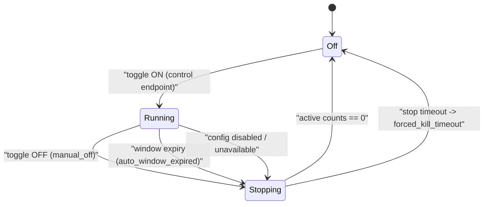

# Adversarial Simulation Operator Guide

Date: 2026-02-27  
Status: Active (`SIM-6`)

This guide defines how operators must interpret adversarial simulation failures and how to tune safely without introducing collateral-risk regressions.

## Scope

Use this guide for:

- `make test-adversarial-fast`
- `make test-adversarial-soak`
- `make test-adversarial-live`
- `make test-adversarial-repeatability`
- `make test-adversarial-promote-candidates`
- `make test-adversarial-scenario-review`
- `make test-adversarial-sim-tag-contract`
- `make test-frontier-unavailability-policy`
- `make test-adversarial-container-isolation`
- `make test-adversarial-container-blackbox`

## SIM Run Definition Of Done (`SIM2-GC-1`)

A run must be treated as complete only when all rules below are true:

1. `latest_report.json` has `passed=true`.
2. `latest_report.json` includes `real_traffic_contract` and `evidence` sections.
3. Every passed scenario includes runtime telemetry evidence in `evidence.scenario_execution`:
   - `runtime_request_count > 0`
   - plus at least one runtime telemetry delta (`monitoring_total_delta`, `coverage_delta_total`, or `simulation_event_count_delta`) above zero.
4. `evidence.control_plane_lineage` is present with:
   - `control_operation_id`, `requested_state`, `desired_state`, `actual_state`, `actor_session`.
5. No synthetic-success pattern is used:
   - no synthetic monitoring injection,
   - no out-of-band metrics writes,
   - no control-plane-only success signaling.
6. Every passed `browser_realistic` scenario includes browser execution evidence:
   - `browser_js_executed=true`,
   - `browser_dom_events > 0`,
   - non-empty `browser_challenge_dom_path`,
   - non-empty request-lineage correlation IDs.

Canonical contract reference:

- [`sim2-real-adversary-traffic-contract.md`](sim2-real-adversary-traffic-contract.md)

All profiles write a report to `scripts/tests/adversarial/latest_report.json` unless `ADVERSARIAL_REPORT_PATH` overrides it.
All runs also emit `scripts/tests/adversarial/attack_plan.json` with frontier mode/provider metadata and sanitized candidate payloads.
Promotion triage emits `scripts/tests/adversarial/promotion_candidates_report.json` with candidate -> replay -> promotion lineage records.
Frontier threshold policy emits `scripts/tests/adversarial/frontier_unavailability_policy.json`.
All manifests and reports are locked to `execution_lane=black_box`; non-black-box lane values are rejected at validation time.
Lane capability boundaries are versioned in `scripts/tests/adversarial/lane_contract.v1.json` and validated by `make test-adversarial-lane-contract`.
Simulation-tag signing contract is versioned in `scripts/tests/adversarial/sim_tag_contract.v1.json` and validated by `make test-adversarial-sim-tag-contract`.
Full-coverage category obligations are versioned in `scripts/tests/adversarial/coverage_contract.v1.json` and validated by `make test-adversarial-coverage-contract`.
Container frontier action grammar contract is versioned in `scripts/tests/adversarial/frontier_action_contract.v1.json` and enforced as reject-by-default by host and worker validators.
Container runtime hardening profile is versioned in `scripts/tests/adversarial/container_runtime_profile.v1.json` and must pass before worker launch.
Signed capability envelopes for executable worker actions are enforced via `scripts/tests/frontier_capability_envelope.py` host/worker validation.
Browser-lane execution proof is enforced via `latest_report.json -> gates.browser_execution_gates`.
`make test-adversarial-live` now classifies failures as `transient` or `fatal`, retries transient cycles with capped backoff, and only terminates after `ADVERSARIAL_FATAL_CYCLE_LIMIT` consecutive fatal cycles.
Container lane emits:
1. `scripts/tests/adversarial/container_isolation_report.json`
2. `scripts/tests/adversarial/container_blackbox_report.json`
3. `container_blackbox_report.json` includes `frontier_action_source` and `frontier_action_lineage` to trace attack-plan candidates to executed requests.
4. `container_blackbox_report.json -> policy_audit` records explicit deny/allow boundary decisions for action validation and egress-policy enforcement.
5. `container_blackbox_report.json -> frontier_candidate_rejections` lists sanitized model outputs that were blocked before execution.
6. `container_blackbox_report.json -> frontier_lineage` reports end-to-end lineage completeness (`model suggestion -> executed action -> runtime events -> monitoring events`).
7. `container_blackbox_report.json -> frontier_runtime_state` surfaces degraded fallback/outage conditions and marks degraded runs as non-passing.
8. `container_blackbox_report.json -> runtime_profile` reports required hardening profile compliance and any launch-blocking violations.
9. `container_blackbox_report.json -> capability_envelopes` reports capability-envelope enforcement posture for executable actions.
10. `container_blackbox_report.json -> cleanup_policy` reports TTL cleanup execution (`deleted_count`, `failed_count`, and per-path diagnostics).
11. `container_blackbox_report.json -> command_channel` reports one-way bounded queue semantics (`queue_capacity`, `overflow_count`, and append-only evidence expectations).
12. `container_blackbox_report.json -> execution_control` and `worker_failure_detail` report kill-switch/heartbeat/deadline teardown outcomes and forced-stop diagnostics.

## Deterministic + Containerized Coexistence Contract (SIM-V2-15)

Current policy is explicit coexistence, not replacement:

1. Deterministic lanes are the canonical protected-lane and release blockers:
   - `make test-adversarial-smoke`
   - `make test-adversarial-abuse`
   - `make test-adversarial-akamai`
   - `make test-adversarial-coverage`
2. Containerized black-box lanes are complementary and scheduled/manual in this phase:
   - `make test-adversarial-container-isolation`
   - `make test-adversarial-container-blackbox`
   - container executions must pass frontier action DSL validation before any request is emitted.
3. Frontier lane remains adaptive discovery input; deterministic replay confirmation remains the blocking regression oracle.

Capability mapping (must stay explicit):

| Requirement family | Deterministic lane (mandatory) | Containerized lane (complementary) |
|---|---|---|
| Merge/release blocking regression oracle | Primary and required | Not used as release blocker in this phase |
| Full category gate contract (`full_coverage`) | Primary and required | Observational/complementary |
| Replay/order/stale deterministic abuse regressions | Primary and required | Complementary realism signal |
| Akamai fixture policy behavior | Primary and required | Not primary coverage contract |
| Isolation boundary and runtime-hardening checks | Not primary | Primary (`container_isolation`) |
| Alternative runtime traffic realism signal | Secondary | Primary (`container_blackbox`) |
| Frontier candidate promotion confirmation | Primary (`promote-candidates` replay gate) | Not primary |

Keep-both-vs-replace decision record:

1. ADR: [`docs/adr/0005-adversarial-lane-coexistence-policy.md`](adr/0005-adversarial-lane-coexistence-policy.md).
2. Required migration checklist template: [`docs/adr/adversarial-lane-parity-signoff-checklist.md`](adr/adversarial-lane-parity-signoff-checklist.md).
3. Deterministic-lane demotion is forbidden without owner approval plus completed parity sign-off evidence.

## Simulation Metadata Tagging and Filtering (SIM-V2-20)

Adversary-generated traffic is tagged at request time with:

1. `sim_run_id`
2. `sim_profile`
3. `sim_lane`
4. `sim_ts`
5. `sim_nonce`
6. `sim_signature` (HMAC-SHA256 over canonical `sim-tag.v1` message)

Storage and read-path policy:

1. Simulation telemetry writes to canonical event/monitoring stores and is identified by metadata fields (`sim_run_id`, `sim_profile`, `sim_lane`, `is_simulation`).
2. Admin read endpoints (`/admin/events`, `/admin/cdp/events`, `/admin/monitoring`, `/admin/monitoring/delta`, `/admin/monitoring/stream`, `/admin/ip-bans/delta`, `/admin/ip-bans/stream`) include tagged simulation rows in runtime-dev by default, with pseudonymized sensitive identifiers unless explicit forensic break-glass is acknowledged (`forensic=1&forensic_ack=I_UNDERSTAND_FORENSIC`).
3. Non-dev runtime remains default-safe because adversary simulation control surfaces are unavailable.
4. Unsigned/invalid/stale/replayed simulation tags must not activate simulation context; requests stay in normal telemetry partition.
5. Invalid simulation-tag attempts emit explicit policy-signal telemetry:
   - `S_SIM_TAG_MISSING_SECRET`
   - `S_SIM_TAG_MISSING_REQUIRED_HEADERS`
   - `S_SIM_TAG_INVALID_HEADER_VALUE`
   - `S_SIM_TAG_INVALID_TIMESTAMP`
   - `S_SIM_TAG_TIMESTAMP_SKEW`
   - `S_SIM_TAG_SIGNATURE_MISMATCH`
   - `S_SIM_TAG_NONCE_REPLAY`

Containerized attacker-lane handling:

1. Container black-box workers must not receive `SHUMA_*` secrets (including `SHUMA_SIM_TELEMETRY_SECRET`).
2. Host orchestrator issues bounded pre-signed sim-tag envelopes per run and passes only those non-secret envelopes into the container.
3. Replay-window checks in runtime enforce one-use nonce semantics for signed tags.

## Sim-Tag Secret Rotation and Troubleshooting

Rotation policy:

1. Rotate `SHUMA_SIM_TELEMETRY_SECRET` whenever adversarial runner hosts are reprovisioned or when simulation-tag validation anomalies are detected.
2. Rotate by updating the secret in `.env.local`/deploy environment, restarting runtime-dev, and re-running `make test-adversarial-fast`.
3. Do not share this secret with containerized attacker lanes; only deterministic host-side signers should hold it.
4. Local dev cadence must rotate at least every 30 days when adversarial lanes are used regularly.
5. CI lanes must use centrally managed secret storage and must not commit raw secret values to repository files.
6. CI secret cadence must rotate at least every 14 days or immediately on suspected compromise.

Compromise-response workflow:

1. Detect: identify leak signal (`S_SIM_TAG_SIGNATURE_MISMATCH` spikes, unexpected nonce replay, or secret exposure evidence).
2. Contain: disable adversarial protected lanes temporarily and rotate `SHUMA_SIM_TELEMETRY_SECRET` in all affected environments.
3. Recover: restart runtime-dev/CI runners, run `make test-adversarial-preflight`, then run `make test-adversarial-fast`.
4. Verify: confirm signature and replay failures return to baseline, then re-enable normal adversarial schedules.
5. Record: capture incident notes with rotation timestamp and impacted environments.

Troubleshooting sequence for failed sim tagging:

1. Confirm runtime guards: `SHUMA_RUNTIME_ENV=runtime-dev` and `SHUMA_ADVERSARY_SIM_AVAILABLE=true`.
2. Confirm secret presence on host runner and runtime process: `SHUMA_SIM_TELEMETRY_SECRET` is non-empty.
3. Run `make test-adversarial-preflight` to verify required secret posture (`missing` vs `placeholder` vs `invalid format`).
4. Run `make test-adversarial-sim-tag-contract` to verify contract parity.
5. Inspect `/metrics` for `bot_defence_policy_signals_total{signal=\"S_SIM_TAG_*\"}` counters and identify dominant failure reason.
6. If failures persist, restart `make dev` to clear stale process env and rerun `make test-adversarial-fast`.

## Frontier Architecture Modes

Frontier attack-candidate generation must run in one of two explicit modes:

1. `single_provider_self_play`
2. `multi_provider_playoff`

Mode semantics:

1. `single_provider_self_play`
   - One configured provider key.
   - Planner/attacker/critic roles remain isolated but share one model family.
   - Discovery confidence is lower because role diversity is reduced.
2. `multi_provider_playoff`
   - Two or more configured provider keys.
   - Cross-provider role assignment increases adversarial diversity.
   - Discovery confidence is higher and this is the recommended protected-lane posture.

Operator guidance:

1. `provider_count=0`: run remains deterministic-only; frontier lane is degraded advisory mode.
2. `provider_count=1`: run remains valid but reduced-diversity warning must be treated as a confidence downgrade.
3. `provider_count>=2`: preferred minimum for higher-confidence discovery.

## Protected-Lane Policy (Deterministic Oracle + Frontier Advisory)

Protected lanes must run both:

1. Deterministic coverage oracle (`make test-adversarial-coverage`) as a blocking gate.
2. Frontier lane attempt (`make test-adversarial-frontier-attempt`) as advisory telemetry.

Rules:

1. Frontier degraded status (missing key, auth error, timeout, provider outage) is non-blocking.
2. Deterministic coverage/replay failures remain merge/release blockers.
3. Frontier attempt output (`scripts/tests/adversarial/frontier_lane_status.json`) must be archived for PR/release auditing.
4. If frontier status remains degraded for 10 consecutive protected-lane runs or 7 days (whichever comes first), operators must open and assign a supported-model refresh action and update frontier model documentation.
5. Protected-lane automation uses `make test-frontier-unavailability-policy` (with `FRONTIER_POLICY_ENABLE_GITHUB=1`) to update tracker state and open/assign refresh action issues when the threshold is crossed.

## Frontier Finding Triage + Promotion (SIM-V2-18)

`make test-adversarial-promote-candidates` is the canonical triage/promotion lane.

Pipeline contract:

1. Normalize frontier findings into stable IDs (`finding_id`) with scenario family, path, headers, cadence pattern, observed outcome, severity, and risk metadata.
2. Carry frontier diversity metadata on every finding (`frontier_mode`, `provider_count`, provider/model list, `diversity_confidence`).
3. Carry generated-candidate lineage metadata on every finding (`candidate_id`, `source_scenario_id`, `generation_kind`, `mutation_class`, `behavioral_class`, `novelty_score`).
4. Attempt deterministic replay for each regression candidate and classify:
   - `confirmed_reproducible`
   - `not_reproducible`
   - `needs_manual_review`
5. Require owner review before any confirmed finding can become a blocking regression case.
6. Enforce diversity policy:
   - `single_provider_self_play`: owner review is mandatory and confidence is reduced.
   - `multi_provider_playoff`: higher initial confidence, but deterministic confirmation and owner review are still mandatory.

Generated-candidate governance must be explicit before replay:

1. `attack_plan.json` must include `attack_generation_contract` metadata (path, schema version, hash).
2. `generation_summary` must report `seed/generated/accepted/rejected` candidate counts.
3. Candidate-level governance fields (`governance_passed`, novelty score, mutation metadata) must be present and valid.
4. Candidates that fail sanitization/policy checks must be recorded under `rejected_candidates` and must not enter replay/promotion.

Operator curation workflow for promoting generated candidates into canonical manifests:

1. Sort `promotion_candidates_report.json` by:
   - `severity` (high first),
   - `replayability` (`confirmed_reproducible` first),
   - then `novelty_score`.
2. For each `confirmed_reproducible` mutation candidate, create or update a deterministic manifest scenario:
   - include `source_scenario_id`,
   - preserve `mutation_class` and `behavioral_class` in scenario description or tags,
   - attach owner and disposition target (`<=48h`).
3. Reject or merge duplicate low-value variants:
   - merge when candidate behavior is already covered by an existing deterministic scenario,
   - reject when collateral risk is not acceptable or replay confidence is insufficient.
4. Archive decision rationale in the promotion artifact (`owner_disposition`, review notes) so lineage remains auditable.

SLA for unresolved high-severity findings:

1. `PR` lanes: unresolved high-severity findings (`confirmed_reproducible` or `needs_manual_review`) must be dispositioned within 24 hours.
2. `Release` lanes: unresolved high-severity findings must be dispositioned before release cut; release remains blocked when deterministic replay confirms a high-severity regression.

## Continuous Defender-Adversary Evolution Cadence (SIM2-GC-12)

This cadence is mandatory and must run every week:

1. `run adversary -> review evidence -> tune defenses -> deterministic replay -> promote or reject`.
2. Owners must be explicit per cycle:
   - `security_engineering` owns adversary discovery quality and triage.
   - `runtime_engineering` owns mitigation changes and replay confirmation.
   - `platform_operations` owns rollout, rollback, and monitoring-health verification.
3. SLAs must be enforced:
   - regression confirmation: `<=24h`,
   - mitigation plan: `<=48h`,
   - owner disposition for promoted findings: `<=48h`.

Promotion rubric (must be recorded for every candidate):

| Dimension | Rule |
| --- | --- |
| `severity` | Must classify expected impact on abuse resistance and operator risk (`low/medium/high`). |
| `reproducibility` | Must prove deterministic replay status (`confirmed_reproducible` vs `not_reproducible`). |
| `collateral_risk` | Must estimate legitimate-user risk (`low/medium/high`) before promotion. |
| `mitigation_readiness` | Must identify mitigation owner and validation plan before blocking promotion. |

KPI reporting (must be reviewed weekly):

1. `attacker_cost_shift`
2. `human_friction_impact`
3. `detection_latency`
4. `mitigation_lead_time`
5. `time to regression confirmation`
6. `time to mitigation`

Rollback playbook for over-trigger on legitimate traffic:

1. Trigger: defense tuning over-triggers legitimate traffic.
2. Required sequence:
   - contain impact,
   - rollback to last known good policy bundle,
   - run `make test-adversarial-fast`,
   - run deterministic replay for affected scenarios,
   - retune with reduced blast radius and revalidate.
3. Operators must not keep an over-triggering policy active while triage is pending.

Architecture review checkpoint:

1. Frequency: monthly.
2. Review focus must include:
   - decentralized orchestration posture,
   - capability-safety boundaries,
   - evidence integrity and lineage completeness.
3. Outcomes must be documented and linked from cycle notes.

## Hybrid Adversary Lane Contract (SIM2-GC-14)

Shuma uses a strict two-lane model:

1. `deterministic_conformance` lane:
   - release-blocking authority,
   - deterministic replay oracle,
   - canonical source for merge/release gating.
2. `emergent_exploration` lane:
   - non-blocking discovery lane,
   - adaptive attack exploration input,
   - may not block release without deterministic confirmation.

Choreography boundary:

1. Intentionally choreographed: `seed_scenarios`, `invariant_assertions`, `resource_guardrails`.
2. Must remain emergent: `crawl_strategy`, `attack_sequencing`, `adaptation`.

Emergent objective model:

1. Target assets: public HTTP surface.
2. Success functions: unexpected allow/monitor outcomes and bypass evidence.
3. Stop conditions: runtime budget exhausted, action budget exhausted, or kill switch.
4. Default emergent envelope must remain bounded to `<=180s` and `<=500 actions`.

Novelty and triage policy:

1. Every emergent finding must include deterministic normalization for:
   - `novelty`,
   - `severity`,
   - `confidence`,
   - `replayability`.
2. Triage ordering must prioritize severity and replayability before novelty.

Promotion bridge (mandatory sequence):

1. `generated_candidate -> deterministic_replay_confirmation -> owner_review_disposition -> promoted_blocking_scenario`.
2. Release-blocking decisions must not depend on stochastic-only emergent outputs.
3. Promotion thresholds are mandatory:
   - deterministic confirmation `>=95%`,
   - false discovery `<=20%`,
   - owner disposition SLA `<=48h`.

Lane metadata and lineage requirements:

1. Promotion artifact must include lane metadata and authority model.
2. Each lineage row must include:
   - `source_lane=emergent_exploration`,
   - `deterministic_replay_lane=deterministic_conformance`,
   - explicit `release_blocking_authority`.
3. Operator language must describe enabled adversary behavior as real attacker activity with deterministic replay used for release confidence.

## Live Loop Guardrails (SIM-V2-9)

Live-loop defaults are operator-observability-first:

1. `ADVERSARIAL_CLEANUP_MODE=0` (default) preserves state between cycles.
2. `ADVERSARIAL_CLEANUP_MODE=1` enables explicit cleanup-per-cycle mode.
3. Cycles that emit only admin/config noise (no meaningful defense event reasons) are classified as fatal-quality failures.
4. Loop logs include cycle classification, retry count, backoff seconds, and terminal failure reason.

## Inputs You Must Capture

For every failing run, operators must capture:

1. Exact command used (`make` target + env overrides).
2. Report artifact (`scripts/tests/adversarial/latest_report.json`).
3. Attack plan artifact (`scripts/tests/adversarial/attack_plan.json`).
4. Runtime config snapshot (`GET /admin/config`) from the failing environment.
5. Monitoring snapshot (`GET /admin/monitoring?hours=24&limit=10` in dev runtime) from the same time window.
6. Commit SHA and environment (`runtime-dev` or `runtime-prod`).
7. Runner plane-separation evidence (`latest_report.json` -> `plane_contract`).
8. Coverage contract evidence (`latest_report.json` -> `coverage_contract`) including schema/hash and category obligations.
9. Realism evidence (`latest_report.json` -> `realism_metrics` + `realism_gates`) for pacing/retry/state-mode conformance.
10. Scenario intent evidence (`latest_report.json` -> `scenario_intent_gates`) to confirm each passed scenario emitted required defense-category signals.

## Triage Order

Operators must triage in this order:

1. Scenario failures in `results` where `passed=false`.
2. Gate failures in `gates.checks` where `passed=false`.
3. Coverage gate failures in `coverage_gates.checks` where `passed=false`.
4. Defense no-op detector failures in `coverage_gates.defense_noop_checks` (`full_coverage`) where `passed=false`.
5. Coverage deltas in `coverage_gates.coverage.deltas` (for `full_coverage`/soak).
6. Persona collateral and cost envelopes in `cohort_metrics`.
7. Realism gate failures in `realism_gates.checks` and persona/runtime evidence in `realism_metrics`.
8. Scenario intent gate failures in `scenario_intent_gates.checks` where per-scenario category evidence or progression constraints failed.
9. Seeded IP-range evidence in `ip_range_suggestions`.
10. Tarpit progression/fallback/escalation counters in Monitoring tab (`Tarpit Progression` section) and `monitoring_after.tarpit.metrics` in report artifacts.

## Dashboard Triage/Replay/Tuning/Validation Loop (SIM2-GC-10)

When triaging adversary activity from `#monitoring`, operators must use this loop:

1. Triage:
   - You must start in `Recent Adversary Runs` and pick the latest `run_id` with unexpected ban outcomes or defense deltas.
   - You must cross-check the same run in `#ip-bans` before concluding no enforcement occurred.
2. Replay candidate isolation:
   - You must set `Recent Events` filters in this order: `origin=Simulation`, matching `scenario`, matching `lane`, then optional `defense`/`outcome`.
   - You must not classify a run as "clean" when Monitoring freshness is `degraded` or `stale`; rerun after freshness returns to `fresh` or capture degraded evidence explicitly.
3. Defense tuning:
   - You must use `Defense Trends` to identify drifted defenses (high triggers with low pass ratio or rising escalations).
   - You must tune one defense area at a time and record the exact config delta with the affected run id(s).
4. Validation:
   - You must rerun `make test-adversarial-fast` after each tuning slice.
   - You must rerun `make test-adversarial-soak` before promotion for threshold/policy changes that impact challenge, PoW, rate-limit, GEO, tarpit, or IP-range pathways.
   - You must verify replay evidence reappears in monitoring (`run_id`, scenario/lane rows, and defense-category outcomes) before marking the issue resolved.

## Scenario Intent Review Process (SIM2-GC-9)

Operators must run `make test-adversarial-scenario-review` at least weekly and before release cuts.

Review process requirements:

1. Confirm each scenario row in `scripts/tests/adversarial/scenario_intent_matrix.v1.json` matches `scenario_manifest.v2.json` for:
   - `expected_defense_categories`,
   - `driver_class`,
   - `traffic_model.persona`,
   - `traffic_model.retry_strategy`.
2. Confirm each category has at least one practical evidence signal mapping and no dead signal rules.
3. Confirm row review metadata is fresh (`last_reviewed_on` within `stale_after_days` governance budget).
4. Remove or refactor rows flagged redundant by signature drift checks before adding new scenarios.
5. Update row notes when scenario realism constraints change (retry, pacing, evasion, or driver-class behavior).

Operators must not tune thresholds before confirming whether failures are scenario mismatches versus gate regressions.

## Coverage Contract Update Protocol

When `full_coverage` obligations must change, update in this order:

1. Update SIM2 plan coverage table in `docs/plans/2026-02-26-adversarial-simulation-v2-plan.md`.
2. Update canonical contract `scripts/tests/adversarial/coverage_contract.v1.json`.
3. Update manifest `profiles.full_coverage.gates` parity in both `scenario_manifest.v1.json` and `scenario_manifest.v2.json`.
4. Run `make test-adversarial-coverage-contract`, `make test-adversarial-manifest`, and `make test-adversarial-coverage`.

`full_coverage` drift is expected to fail fast if any of these artifacts diverge.

## Scenario Failure Interpretation

When `passed=false`, use `driver`, `expected_outcome`, `observed_outcome`, and `detail`.

### Driver-to-Action Mapping

| Driver | Expected posture | Primary checks | Typical operator action |
|---|---|---|---|
| `allow_browser_allowlist` | `allow` | browser allowlist and policy mode | Correct allowlist entries; avoid broad wildcarding |
| `not_a_bot_pass` | `not-a-bot` | Not-a-Bot token flow and pass scoring | Adjust pass/fail scores in small increments |
| `not_a_bot_replay_abuse` / `not_a_bot_stale_token_abuse` / `not_a_bot_ordering_cadence_abuse` | `maze` | replay/order/timing protections | Keep abuse escalation strict; fix sequence checks if downgraded |
| `not_a_bot_replay_tarpit_abuse` | `tarpit` | replay abuse escalation through tarpit entry path | Keep tarpit enabled + budgeted; investigate fallback/escalation if downgraded to block |
| `challenge_puzzle_fail_maze` | `maze` | puzzle failure routing and sequence envelope checks | Preserve incorrect-answer fallback semantics and sequence validation |
| `pow_success` | `allow` | `/pow` issue + `/pow/verify` success | Validate PoW difficulty/TTL and sequence timing envelope |
| `pow_invalid_proof` | `monitor` | PoW invalid proof rejection path | Ensure invalid proof remains rejected; do not downgrade to allow |
| `rate_limit_enforce` / `retry_storm_enforce` | `deny_temp` | limiter thresholds and enforcement mode under burst traffic | Verify `rate_limit`, provider mode, retry-storm posture, and outage posture |
| `geo_challenge` / `geo_maze` / `geo_block` | `challenge` / `maze` / `deny_temp` | GEO lists and trusted header gating | Confirm country list routing and trusted header behavior |
| `header_spoofing_probe` | `monitor` | untrusted forwarded/header spoof rejection semantics | Ensure spoofed headers do not trigger privileged GEO enforcement |
| `honeypot_deny_temp` | `deny_temp` | honeypot path and ban enforcement | Verify honeypot remains active and banning works |
| `fingerprint_inconsistent_payload` | `monitor` | malformed external fingerprint ingestion handling | Keep invalid payload rejection deterministic (`400`) without bypassing telemetry |
| `cdp_high_confidence_deny` | `deny_temp` | CDP ingest + auto-ban deny path | Confirm follow-up request is denied and event taxonomy is present |
| `akamai_additive_report` | `monitor` | additive edge signal ingest | Keep additive mode non-authoritative |
| `akamai_authoritative_deny` | `deny_temp` | authoritative edge deny path | Verify deny only in authoritative mode |

## Gate Failure Interpretation

`gates.checks` includes quantitative assertions.

Common SIM-v2 checks and expected operator response:

- `human_like_collateral_ratio`
  - Investigate `cohort_metrics.human_like.collateral_ratio` first.
  - Tune challenge/maze/tarpit escalation thresholds before editing ratio bounds.
- `event_reason_prefix_*`
  - Confirm required event taxonomy is still emitted and prefixed consistently.
  - Fix route/reason wiring before relaxing required prefixes.
- `ip_range_suggestion_seed_match`
  - Inspect `ip_range_suggestions.seed_evidence`, `matched_seed_suggestions`, and `near_miss_suggestions`.
  - Do not suppress this gate; fix seeding prerequisites or suggestion aggregation drift.

## Dashboard Toggle Orchestration (SIM-V2-9A)

The dashboard `Adversary Sim` global toggle is the only supported UI control path for dev orchestration lifecycle.

Control-plane endpoints:

1. `POST /admin/adversary-sim/control` for explicit ON/OFF transitions.
2. `GET /admin/adversary-sim/status` for phase + guardrail visibility.
3. `POST /admin/adversary-sim/history/cleanup` for explicit retained-telemetry cleanup.

Lifecycle semantics:

1. `generation_active` describes whether adversary traffic producers are currently running.
2. `historical_data_visible` remains `true` after auto-off; retained telemetry stays queryable until retention expiry or explicit cleanup.
3. `history_retention` status fields expose retention window, cleanup command, and `retention_health` lifecycle state.
4. `retention_health.state` must be interpreted as:
   - `healthy`: no expired telemetry buckets pending purge and no worker error.
   - `degraded`: purge lag or pending expired buckets detected; operator intervention required.
   - `stalled`: purge worker encountered deterministic failure (`last_error` populated); treat retention guarantees as at risk until cleared.

Guardrail constants (hard-coded, not operator-configurable):

1. `max_duration_seconds=900` (runtime key `adversary_sim_duration_seconds` is bounded to `30..900`, default `180`).
2. `max_concurrent_runs=1`.
3. `cpu_cap_millicores=1000`.
4. `memory_cap_mib=512`.
5. `queue_policy=reject_new`.

Lifecycle state diagram:

Failure-handling rules:

1. Unauthenticated, unauthorized, and CSRF-invalid control attempts must be rejected and written to admin event log.
2. If stop does not converge to zero-active state before stop timeout, orchestrator must force-kill and return to safe `off` state.
3. If runtime is not `runtime-dev` or `SHUMA_ADVERSARY_SIM_AVAILABLE=false`, control/status endpoints must fail closed (`404`).
4. Status polling and lifecycle-state rendering are presentation only; defense behavior remains server-authoritative.
5. Use `make adversary-sim-history-clean` only when explicit history reset is required; auto-off must not be treated as data deletion.
6. If `retention_health.state=degraded|stalled`, operators must capture `retention_health.last_error`, `purge_lag_hours`, and `pending_expired_buckets` in incident notes before remediation.

Retention troubleshooting and rollback:

1. Check `/admin/monitoring` `retention_health` first:
   - confirm `retention_hours`,
   - inspect `purge_lag_hours` and `pending_expired_buckets`,
   - capture `last_error` and `last_purged_bucket`.
2. If `state=degraded`, keep lanes running but prioritize root-cause and verify `pending_expired_buckets` returns to `0`.
3. If `state=stalled`, treat retention worker as failed and investigate `last_error` before relying on retention expiry for sensitive data.
4. After remediation, rerun deterministic checks and confirm `state=healthy` before closing incident.

Cost-governance troubleshooting and rollback:

1. Check `/admin/monitoring` `details.cost_governance` first:
   - `cardinality_pressure`,
   - `payload_budget_status`,
   - `sampling_status`,
   - `query_budget_status`,
   - `degraded_state` and `degraded_reasons`.
2. Operators must treat `unsampleable_event_drop_count` as a hard safety signal: it must remain `0`.
3. If `query_budget_status=exceeded`, operators must reduce dashboard query cost immediately by lowering `hours` and/or `limit` before changing thresholds.
4. If `payload_budget_status=exceeded`, operators must use cursor endpoints (`/admin/monitoring/delta` or `/admin/monitoring/stream`) for drill-down instead of increasing base payload limits.
5. If `compression.status=not_negotiated`, clients must send `Accept-Encoding: gzip` for payloads above `64KB`.
6. If `compression.status=below_target|compression_error`, operators must capture `compression.input_bytes`, `compression.output_bytes`, and `compression.reduction_percent` in incident notes, then prioritize payload-shaping fixes.
7. Rollback must not disable unsampleable protections; if a cost-control rollback is required, revert query/payload/compression controls first while keeping unsampleable policy and cardinality caps active.

Security/privacy troubleshooting and incident response:

1. Check `/admin/monitoring` `security_privacy.classification` first and confirm `field_classification_enforced=true`.
2. Check `security_privacy.sanitization.secret_canary_leak_count`; it must remain `0`.
3. Check `security_privacy.access_control.view_mode`; default must be `pseudonymized_default`.
4. For forensic investigations, operators must explicitly acknowledge break-glass (`forensic=1&forensic_ack=I_UNDERSTAND_FORENSIC`) and record the reason in incident notes.
5. If `security_privacy.incident_response.state=operator_action_required`, operators must execute containment workflow in order: `detect -> contain -> quarantine -> operator_action_required`.
6. If retention override is requested (`security_privacy.retention_tiers.override_requested=true`), operators must record `override_audit_entry` before any policy change.

### `latency_p95` Failure

- Operators must verify runtime saturation before relaxing latency limits.
- Operators must not widen thresholds by more than 20% in one change.

### `ratio_*` Failure

- Operators must confirm scenario composition did not change.
- Operators must tune policy inputs (for example rate/GEO/Not-a-Bot thresholds), not the ratio bounds first.
- Operators must update ratio bounds only after observed behavior is intentionally changed and documented.

### `telemetry_*_amplification` Failure

- Operators must treat this as a resource/cost regression first.
- Operators must reduce noisy writes (event volume, duplicate logging paths) before relaxing amplification limits.

### `coverage_*` Failure (Soak)

- Operators must confirm the corresponding scenario driver actually executed.
- Operators must confirm monitoring counters are still mapped to the same semantic event.
- Operators must not disable coverage checks to make failures disappear.

## Safe Tuning Rules

1. Operators must change one control family at a time (for example only `rate_limit` knobs, then rerun).
2. Operators must rerun `make test-adversarial-fast` after every tuning change.
3. Operators must rerun `make test-adversarial-soak` before promotion when tuning touched PoW/rate/GEO/Akamai pathways.
4. Operators must document every threshold change with before/after values and reason.
5. Operators must not combine unrelated policy and observability changes in one promotion.

## Rollback Rules

Rollback must be immediate when any of the following occurs:

1. `fast` profile fails after a tuning change.
2. Any abuse scenario downgrades from `maze`/`deny_temp` to `allow`/`monitor`.
3. Telemetry amplification exceeds bounds by more than 2x baseline.
4. GEO/Rate/PoW enforcement drops below expected coverage deltas in soak.

Rollback action:

1. Restore last known-good config snapshot.
2. Re-run `make test-adversarial-fast`.
3. Re-run `make test-adversarial-soak` before reattempting promotion.
