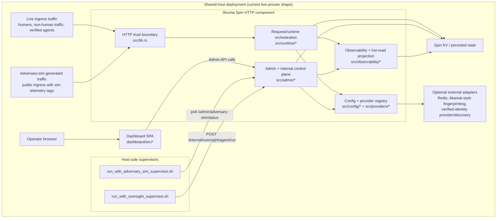
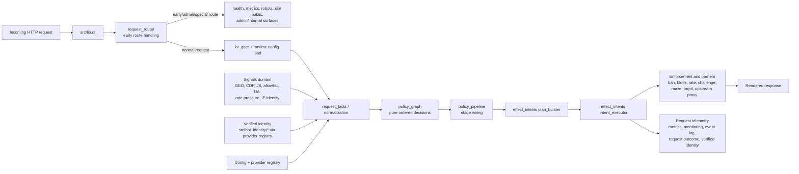
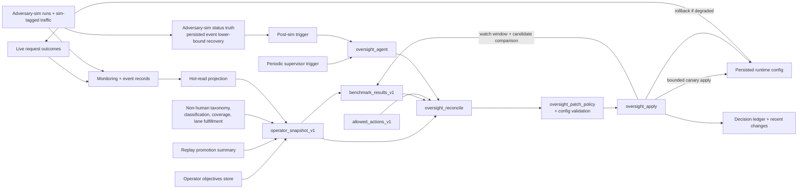

# 🐙 Current System Architecture

This document describes the current landed Shuma-Gorath architecture on `main`.

It is a current-state reference, not an <abbr title="Architecture Decision Record">ADR</abbr>. Use [`docs/adr/`](adr/README.md) for architectural decisions and this document for the shape of the system as it exists today.

Primary reference sources:

- [`module-boundaries.md`](module-boundaries.md)
- [`project-principles.md`](project-principles.md)
- [`research/2026-03-22-live-linode-feedback-loop-proof.md`](research/2026-03-22-live-linode-feedback-loop-proof.md)
- [`research/2026-03-23-adv-diag-1-adversary-sim-status-truth-post-implementation-review.md`](research/2026-03-23-adv-diag-1-adversary-sim-status-truth-post-implementation-review.md)

## 🐙 Architecture Summary

Current pre-launch Shuma is a shared-host-first Rust control plane with:

- a thin HTTP trust-boundary shell in [`src/lib.rs`](../src/lib.rs),
- functional-core request orchestration in [`src/runtime/`](../src/runtime),
- barrier and signal domains for defence execution,
- a machine-first observability layer in [`src/observability/`](../src/observability),
- an admin/control plane in [`src/admin/`](../src/admin),
- bounded provider seams in [`src/providers/`](../src/providers),
- and a live-proven bounded feedback loop for adversary simulation, diagnosis, bounded config canary apply, watch-window comparison, and rollback.

The current closed loop is for bounded config tuning. The later broader LLM diagnosis and code-evolution loops are intentionally not part of the landed architecture yet.

## 🐙 System Context

## 🐙 Request-Time Runtime

## 🐙 Control And Feedback Loop

## 🐙 Domain Map

- Request trust boundary: [`src/lib.rs`](../src/lib.rs)
- Runtime orchestration: [`src/runtime/`](../src/runtime)
- Admin/control plane: [`src/admin/`](../src/admin)
- Observability and hot-read contracts: [`src/observability/`](../src/observability)
- Config and allowed action surfaces: [`src/config/`](../src/config)
- Provider seams and backend selection: [`src/providers/`](../src/providers)
- Signals: [`src/signals/`](../src/signals)
- Enforcement and barriers: [`src/enforcement/`](../src/enforcement), [`src/challenge/`](../src/challenge), [`src/maze/`](../src/maze), [`src/tarpit/`](../src/tarpit), [`src/deception/`](../src/deception)
- Verified non-human identity: [`src/bot_identity/`](../src/bot_identity)
- Dashboard operator surface: [`dashboard/src/`](../dashboard/src)
- Shared-host supervisor wrappers: [`scripts/run_with_adversary_sim_supervisor.sh`](../scripts/run_with_adversary_sim_supervisor.sh), [`scripts/run_with_oversight_supervisor.sh`](../scripts/run_with_oversight_supervisor.sh)

## 🐙 Live-Proven Current State

The current live-proven shape on Linode is:

- shared-host execution is the active full control-plane deployment model,
- periodic oversight runs are triggered by the host-side oversight supervisor,
- adversary-sim runs generate traffic through the public ingress path,
- completed sim status can now recover truthful lower-bound counters from persisted simulation-tagged event evidence,
- and the first bounded config canary loop is live-proven end to end.

Operational proof references:

- [`research/2026-03-22-live-linode-feedback-loop-proof.md`](research/2026-03-22-live-linode-feedback-loop-proof.md)
- [`research/2026-03-23-adv-diag-1-adversary-sim-status-truth-post-implementation-review.md`](research/2026-03-23-adv-diag-1-adversary-sim-status-truth-post-implementation-review.md)

## 🐙 Not Yet In The Landed Architecture

These are intentionally downstream and should not be mistaken for current-state architecture:

- the later broader LLM-backed diagnosis/config harness,
- benchmark-driven code evolution and optional PR generation,
- a mature central-intelligence service architecture,
- and a full Monitoring overhaul that replaces the older mixed monitoring surfaces with a thin operator projection over the machine-first contracts.
